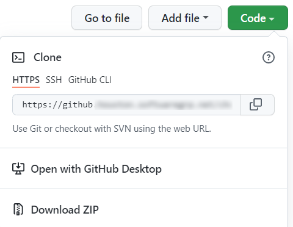

# IDOL OEM Tutorials

A set of guides to get you doing great things with IDOL Eduction and KeyView SDKs.

---

- [Target audience](#target-audience)
- [Aims](#aims)
- [Obtaining tutorial materials](#obtaining-tutorial-materials)
- [Get started](#get-started)
- [License](#license)
   
---

## Target audience

You! If you have access to IDOL software and want to analyze files as part of your product or solution.

## Aims

- Get hands on with IDOL KeyView and Eduction sample programs.  Familiarize yourself with key concepts.
- Select from walkthroughs showcasing different capabilities of IDOL KeyView and Eduction, from file type identification to text extraction and PII entity discovery.
- Compile sample code to see how IDOL Eduction and KeyView SDKs can be embedded in your products.

## Obtaining tutorial materials

Get a local copy of this tutorial to give you all the configuration files and sample media you will need.  You can either clone this repository or download the `.zip` from [GitHub](https://github.houston.softwaregrp.net/christopher-blanks/idol-oem-tutorials).

Throughout the tutorial, we will assume these materials are stored under `C:\MicroFocus`.  File paths and other resources are currently documented for Windows, but other supported platforms (e.g. Linux, MacOS, etc) will work with appropriate modifications.

You can stay on GitHub to follow the steps in this and further linked README files in your browser or, if you prefer to work with the downloaded files, see [these steps](./appendix/markdown_reader.md) for some convenient offline reading options.

## Get started

The tutorials start [here](tutorials/README.md)!

## License

(c) Copyright 2023 Micro Focus International plc.

Licensed under the MIT License (the "License"); you may not use this project except in compliance with the License.
