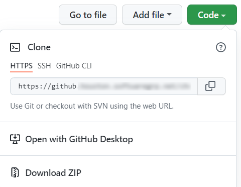

# Knowledge Discovery and File Content Extraction OEM Tutorials

A set of guides to introduce you to OpenText Knowledge Discovery (formerly known as IDOL) and OpenText File Content Extraction (formerly known as KeyView) and associated integration options.

---

- [Taster](#taster)
- [Introduction](#introduction)
- [Obtaining tutorial materials](#obtaining-tutorial-materials)
  - [Following this guide offline](#following-this-guide-offline)
- [Getting Started](#getting-started)
  - [Named Entity Recognition](#named-entity-recognition)
  - [Filter](#filter)
  - [Export](#export)
  - [ACI API](#aci-api)
- [Capability showcase examples](#capability-showcase-examples)
  - [Named Entity Recognition showcase](#named-entity-recognition-showcase)
  - [Filter SDK showcase](#filter-sdk-showcase)
  - [Export SDK showcase](#export-sdk-showcase)
  - [ACI API showcase](#aci-api-showcase)
- [Use the SDKs](#use-the-sdks)
  - [Named Entity Recognition SDK](#named-entity-recognition-sdk)
  - [Filter SDK](#filter-sdk)
  - [Export SDK](#export-sdk)
  - [Filter + Eduction](#filter--eduction)
- [See also](#see-also)
  - [Media Server tutorials](#media-server-tutorials)
  - [Links](#links)
    - [Named Entity Recognition references](#named-entity-recognition-references)
    - [Filter SDK references](#filter-sdk-references)
    - [Export SDK references](#export-sdk-references)

---

## Taster

Take a quick first look at OpenText Knowledge Discovery and File Content Extraction.  

1. Watch a video introducing File Content Extraction's comprehensive handling of file formats, from identification to filtering and viewing:

   - [Watch 1](https://www.youtube.com/watch?v=66niyCTNtLM&list=PLlUdEXI83_Xoq5Fe2iUnY8fjV9PuX61FA).
   - [Watch 2](https://www.youtube.com/watch?v=QYEFlziEdTo&list=PLlUdEXI83_Xoq5Fe2iUnY8fjV9PuX61FA).

1. Watch a video exploring the use of Named Entity Recognition to identify sensitive data, such as PII, within free text:

   - [Watch](https://www.youtube.com/watch?v=ftGL0p0PanU&list=PLlUdEXI83_Xoq5Fe2iUnY8fjV9PuX61FA).

## Introduction

These OEM tutorials consist of four branches:

- Named Entity Recognition (aka Eduction),
- Filter,
- Export, and
- ACI API (including Connectors)

Once you've mastered the basics of one or all components in the following section, look further down this page for many examples of more advanced usage.  

> NOTE: Be aware that [resources](../resources) distributed with these tutorials are available for download.

## Obtaining tutorial materials

Get a local copy of this tutorial to give you all the configuration files and sample media you will need.  You can either clone this repository or download the `.zip` from [GitHub](https://github.com/opentext-idol/idol-oem-tutorials).

In the following tutorials, we will assume these materials are stored under `C:\OpenText`.

### Following this guide offline

You can stay on GitHub to follow the steps in this and further linked README files in your browser or, if you prefer to work with the downloaded files, see [these steps](../appendix/Markdown_reader.md) for some convenient offline reading options.

## Getting Started

Choose where to start below.

### Named Entity Recognition

Get started with Named Entity Recognition.  Use the out-of-the-box binaries to develop your understanding of the key features and capabilities for matching entities in unstructured, semi-structured and structured text.

[Get started](./eduction/introduction.md).

### Filter

Build a firm foundation with the Filter SDK.  Use the out-of-the-box binaries to develop your understanding of the key features and capabilities for extracting (filtering) text, metadata and sub-files from files.

[Get started](./keyview_filter/introduction.md).

### Export

Build a firm foundation with the Export SDK.  Use the out-of-the-box binaries to develop your understanding of the key features and capabilities for producing HTML, XML and PDF renditions.

[Get started](./keyview_export/introduction.md).

### ACI API

Learn how to communicate with any ACI server using the ACI API.  Use sample code in C, Java, .NET and/or Python to build your understanding.

[Get started](./aci_api/introduction.md).

## Capability showcase examples

> NOTE: The following assume familiarity with Named Entity Recognition and/or Filter SDK concepts and are best started after completing the respective getting started lesson above.

Choose an OEM product below and dip into any of the linked showcase lessons to try more features and expand your knowledge.

### Named Entity Recognition showcase

Explore more Named Entity Recognition features.

[Get started](./eduction/README.md#capability-showcase).

### Filter SDK showcase

Do more with the Filter SDK.

[Get started](./keyview_filter/README.md#capability-showcase).

### Export SDK showcase

Do more with the Export SDK.

[Get started](./keyview_export/README.md#capability-showcase)

### ACI API showcase

More advanced example usage of the ACI API.

[Get started](./aci_api/README.md#capability-showcase).

## Use the SDKs

The Named Entity Recognition SDK and the Filter SDK are designed to be embedded into other services.  For example, OpenText embeds both SDKs into [NiFi processors](https://www.microfocus.com/documentation/idol/knowledge-discovery-25.4/NiFiIngest_25.4_Documentation/Help/Content/Walkthrough/BuildBasicPipeline.htm) to be used in data transformation workflows.

Many other OpenText products also embed the Named Entity Recognition SDK and the Filter SDK to enhance their capabilities.  Other ISVs also license Knowledge Discovery and File Content Extraction, embedding these SDKs into their applications and services for:

- data loss prevention (DLP) and other security and information governance needs,
- document / content management,
- archiving and eDiscovery, and
- many other use cases.

### Named Entity Recognition SDK

Use the SDK to perform extraction and more.

[Get started](./eduction/README.md#use-the-named-entity-recognition-sdk-api).

### Filter SDK

Use the SDK to work with your files.

[Get started](./keyview_filter/README.md#use-the-filter-sdk).

### Export SDK

Use the SDK to work with your files.

[Get started](./keyview_export/README.md#use-the-export-sdk).

### Filter + Eduction

Use the Filter and Named Entity Recognition SDKs into a combined solution.

[Get started](./keyview_filter+eduction/README.md#use-the-filter-sdk-and-named-entity-recognition-sdk)

---

## See also

### Media Server tutorials

Media Server performs analytics on images, audio and video.  It's for OEMs too, via the ACI API.

[Get started](https://github.com/opentext-idol/idol-rich-media-tutorials).

### Links

- Full administration guides and release notes are available for all Knowledge Discovery and File Content Extraction products [here](https://www.microfocus.com/documentation/idol/).
- Read more tips on working with Knowledge Discovery products in [Expert](https://www.microfocus.com/documentation/idol/knowledge-discovery-25.4/IDOLServer_25.4_Documentation/Guides/html/expert/index.html).
- See the latest release notes for all Knowledge Discovery products [here](https://www.microfocus.com/documentation/idol/knowledge-discovery-25.4/IDOLReleaseNotes_25.4_Documentation/idol/Content/_Introduction.htm).

#### Named Entity Recognition references

- Named Entity Recognition SDK [User & Programming Guide](https://www.microfocus.com/documentation/idol/knowledge-discovery-25.4/EductionSDK_25.4_Documentation/Guides/html/)
- Named Entity Recognition Server [Reference Guide](https://www.microfocus.com/documentation/idol/knowledge-discovery-25.4/EductionServer_25.4_Documentation/Help/Content/_ACI_Welcome.htm)
- Named Entity Recognition Grammars [User Guide](https://www.microfocus.com/documentation/idol/knowledge-discovery-25.4/EductionGrammars_25.4_Documentation/Help/)

#### Filter SDK references

- [Filter SDK C Programming Guide](https://www.microfocus.com/documentation/idol/knowledge-discovery-25.4/KeyviewFilterSDK_25.4_Documentation/Guides/html/c-programming/index.html)
- [Filter SDK C++ Programming Guide](https://www.microfocus.com/documentation/idol/knowledge-discovery-25.4/KeyviewFilterSDK_25.4_Documentation/Guides/html/cpp-programming/index.html)
- [Filter SDK Java Programming Guide](https://www.microfocus.com/documentation/idol/knowledge-discovery-25.4/KeyviewFilterSDK_25.4_Documentation/Guides/html/java-programming/index.html)
- [Filter SDK .NET Programming Guide](https://www.microfocus.com/documentation/idol/knowledge-discovery-25.4/KeyviewFilterSDK_25.4_Documentation/Guides/html/dotnet-programming/index.html)
- [Filter SDK Python Programming Guide](https://www.microfocus.com/documentation/idol/knowledge-discovery-25.4/KeyviewFilterSDK_25.4_Documentation/Guides/html/python-programming/index.html)

#### Export SDK references

- [HTML Export SDK C Programming Guide](https://www.microfocus.com/documentation/idol/knowledge-discovery-25.4/KeyviewExportSDK_25.4_Documentation/Guides/html/html-export-c/index.html)
- [HTML Export SDK Java Programming Guide](https://www.microfocus.com/documentation/idol/knowledge-discovery-25.4/KeyviewExportSDK_25.4_Documentation/Guides/html/html-export-java/index.html)
- [XML Export SDK C Programming Guide](https://www.microfocus.com/documentation/idol/knowledge-discovery-25.4/KeyviewExportSDK_25.4_Documentation/Guides/html/xml-export-c/index.html)
- [XML Export SDK Java Programming Guide](https://www.microfocus.com/documentation/idol/knowledge-discovery-25.4/KeyviewExportSDK_25.4_Documentation/Guides/html/xml-export-java/)
- [PDF Export SDK C Programming Guide](https://www.microfocus.com/documentation/idol/knowledge-discovery-25.4/KeyviewExportSDK_25.4_Documentation/Guides/html/pdf-export-c/index.html)
