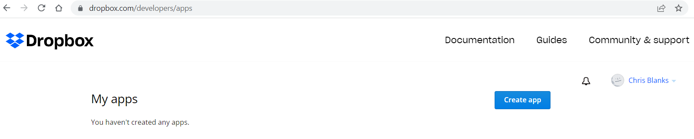
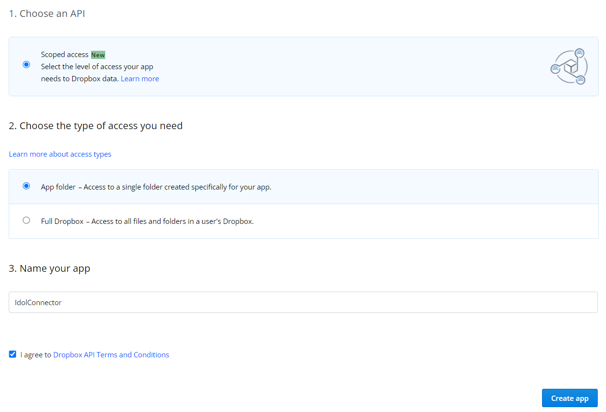
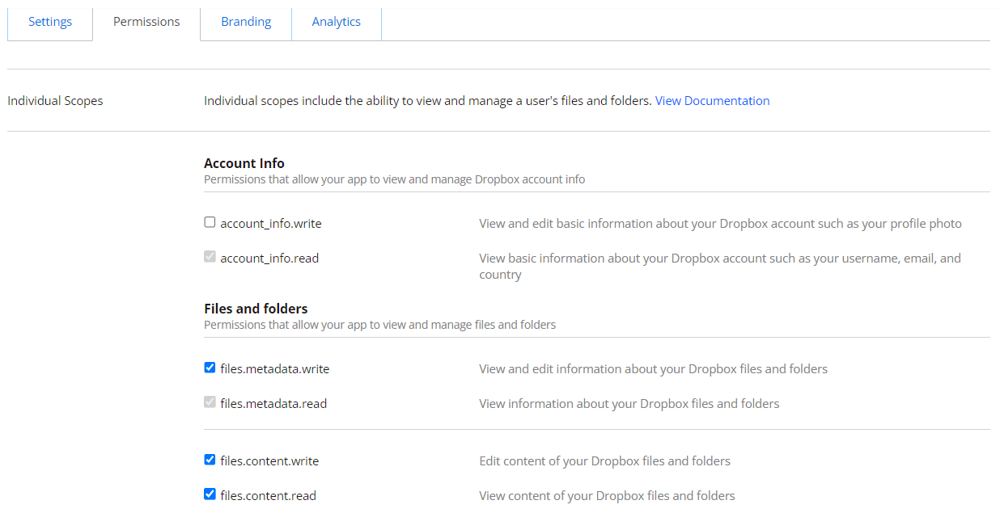
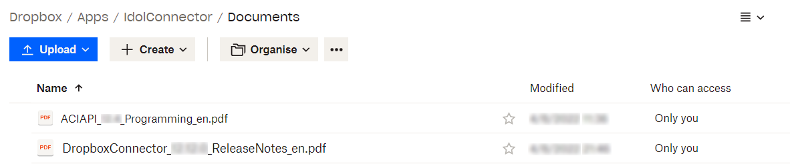
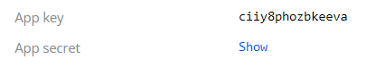
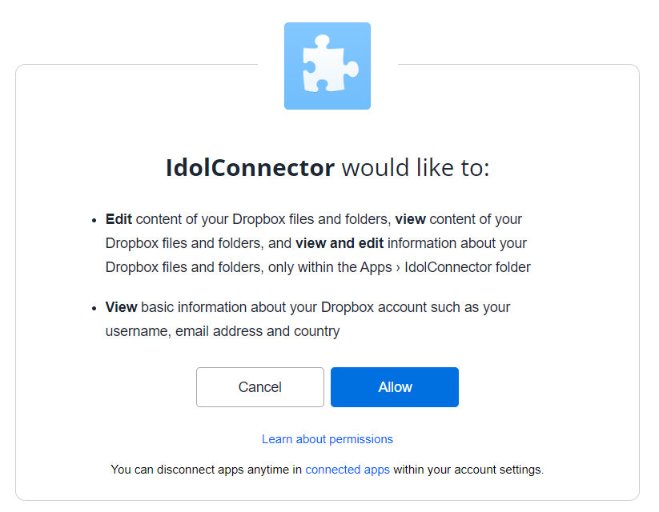
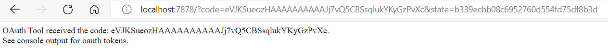
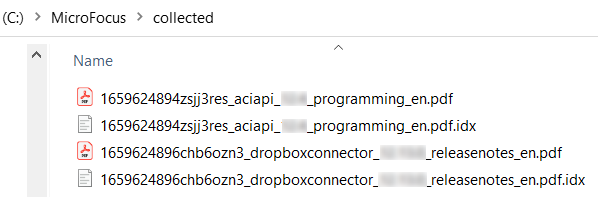
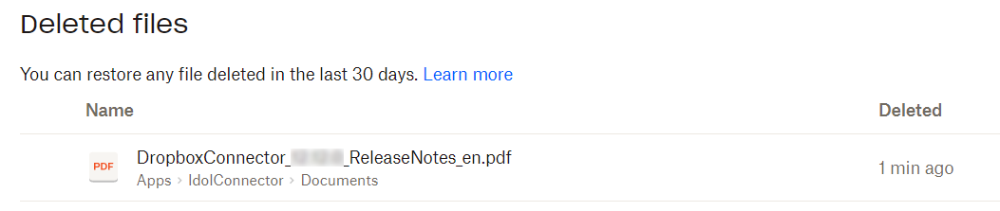
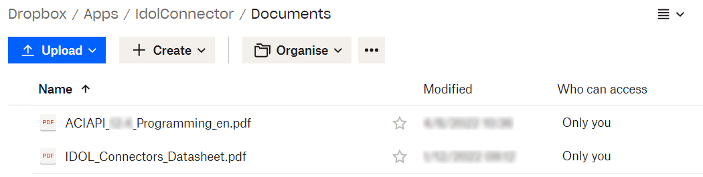

# API-driven file actions with Dropbox Connector

Aims:

- Set up a Dropbox account and create a Dropbox developer application to represent the Dropbox Connector
- Install and configure Dropbox Connector on Windows
- Use ACI API to direct the Connector to:
  - list file identifiers,
  - collect a file,
  - delete a file, and
  - insert a file.

---

- [Required materials](#required-materials)
- [Dropbox setup](#dropbox-setup)
  - [Create a Dropbox application](#create-a-dropbox-application)
  - [Add sample files to Dropbox](#add-sample-files-to-dropbox)
- [Connector setup](#connector-setup)
  - [Dropbox Connector installation](#dropbox-connector-installation)
  - [Disable scheduled tasks](#disable-scheduled-tasks)
  - [OAuth configuration](#oauth-configuration)
- [Run Dropbox Connector](#run-dropbox-connector)
- [Use Connector API](#use-connector-api)
  - [Get status](#get-status)
  - [List file identifiers](#list-file-identifiers)
  - [Collect a file](#collect-a-file)
  - [Delete a file](#delete-a-file)
  - [Insert a file](#insert-a-file)
- [Conclusion](#conclusion)
- [See also](#see-also)

---

## Required materials

To follow this tutorial you will need:

- A Windows PC
- A text editor
- The following installation media:
  - `dropboxconnector_25.1.0_WINDOWS_X86_64.zip`
  - `Versionkey_25.1.0_COMMON.zip`
- A web browser with access to the internet
- Python3 installed

## Dropbox setup

Create a standard (free) Dropbox account on [dropbox.com](https://www.dropbox.com).

> NOTE: Mapped Security is only available for Dropbox for Business accounts and is out of scope for this tutorial.  Please read the [admin guide](https://www.microfocus.com/documentation/idol/knowledge-discovery-25.1/DropboxConnector_25.1_Documentation/Help/Content/Dropbox_MappedSecurity.htm) for details.

### Create a Dropbox application

Create an app to represent this connector on the [Dropbox developer's page](https://www.dropbox.com/developers/apps):

1. Click the "Create app" button:
    

1. Complete the new app form:
    

    > NOTE: I have configured my app for "App folder" access.  Please refer to the Dropbox [documentation](https://developers.dropbox.com/oauth-guide), under "Content Access", to decide which is best for you.

1. Under your app's "Settings" tab, add the default Redirect URL `http://localhost:7878/`, then click the "Add" button:

    

1. Under your app's "Permissions" tab, enable the items as directed in point 6 of the [admin guide](https://www.microfocus.com/documentation/idol/knowledge-discovery-25.1/DropboxConnector_25.1_Documentation/Help/Content/ConfigureOAuth.htm) for a standard Dropbox account:
    

1. Click the "Submit" button.

### Add sample files to Dropbox

If you created your Dropbox app with "App folder" access, as in this lesson, you will see an "Apps" folder in your route Dropbox directory, which will contain a folder with the name of your app, *e.g.* "IdolConnector".

Copy the following two files from the `sample_files` directory up to Dropbox for testing:

- `ACIAPI_12.4_Programming_en.pdf`
- `DropboxConnector_12.13.0_ReleaseNotes_en.pdf`

Place them, for example, in a new sub-directory called "Documents":



## Connector setup

### Dropbox Connector installation

1. Unzip the Dropbox Connector `dropboxconnector_25.1.0_WINDOWS_X86_64.zip` to give the directory `C:\OpenText\dropboxconnector_25.1.0_WINDOWS_X86_64`.

1. Copy your OEM license key `.dat` file into `C:\OpenText\dropboxconnector_25.1.0_WINDOWS_X86_64\` and rename it to `licensekey.dat`.

    > HINT: this key will typically have been named `licensekeyInternal.dat` when you received it.

1. Extract the file `versionkey.dat` from `Versionkey_25.1.0_COMMON.zip`, then copy that file into `C:\OpenText\EductionServer_25.1.0_WINDOWS_X86_64` as described in the [upgrade guide](https://www.microfocus.com/documentation/idol/knowledge-discovery-25.1/IDOLReleaseNotes_25.1_Documentation/idol/Content/Upgrade/Licenses.htm).

1. On Windows, you may need to install the included Visual C++ Redistributable package.  In the same Dropbox Connector folder, right-click on `vcredist.exe` then select 'Run as administrator'.

    > HINT: If you see a version conflict error here, you may need to first uninstall any existing version.

__*DO NOT START THE CONNECTOR YET!*__

### Disable scheduled tasks

Before moving ahead, we will turn off the default scheduled tasks, since we will be using the API rather than a schedule to drive connector actions.

Open the configuration file `dropboxconnector.cfg` for editing.

Update the "Connector" section to disable scheduled tasks:

```diff
[Connector]
EnableIngestion=true
- EnableScheduledTasks=true
+ EnableScheduledTasks=false
```

Save your configuration file.

### OAuth configuration

From the unzipped Dropbox Connector folder, open the configuration file `oauth_tool.cfg` for editing.

If needed in your environment, update the "default" section with your proxy host and port, *e.g.*:

```ini
[default]
SSLMethod=Negotiate
TempDirectory=.
ProxyHost=web-proxy.acmecorp.net
ProxyPort=8080
```

Back on the Dropbox Developer's page, under your app's Settings tab, copy you "App key" and "App secret" values:

  

Use those values to modify the "OAuthTool" section of your config file as follows:

```ini
[OAuthTool]
OAuthVersion=2.0
SiteName=Dropbox
AuthorizeUrl=https://www.dropbox.com/oauth2/authorize?token_access_type=offline
TokenUrl=https://api.dropbox.com/oauth2/token
RefreshUrl=https://api.dropbox.com/oauth2/token
TokenParameters=
//NOTE: this url must be added to the oauth applications redirect_uri list
RedirectUrl=http://localhost:7878/
AppKey=ciiy8phozbkeeva
AppSecret=<SECRET_KEY>
```

Save your configuration file.

From the command line, run the following commands:

```sh
> cd dropboxconnector_25.1.0_WINDOWS_X86_64
> oauth_tool.exe oauth_tool.cfg OAuthTool
Waiting for code...
```

Your default web browser will open on the Dropbox site. As prompted, log in to your Dropbox account, click the "Continue" button, then click "Allow" to grant consent:



After this, you browser page will automatically be redirected and a code displayed:



The command line process will complete automatically, showing:

```sh
...code received: eVJKSueozHAAAAAAAAAAJj7vQ5CBSsqlukYKyGzPvXc
[OAUTH]
Oauth2SitesFile=oauth2_sites.bin
Oauth2SiteName=Dropbox
```

Notice that the Oauth tool has now created two new files in the current directory: `oauth.cfg` and `oauth2_sites.bin`.

Later on, we will reference this `oauth.cfg` file in our tasks in enable interaction between the Dropbox Connector and your Dropbox account.

## Run Dropbox Connector

Now, for the simplest start-up, double-click the `dropboxconnector.exe`.

> NOTE: Please read the [documentation](https://www.microfocus.com/documentation/idol/knowledge-discovery-25.1/IDOLServer_25.1_Documentation/Guides/html/gettingstarted/Content/Shared_Admin/Installation/_ADM_Install_WindowsServices.htm) for instructions to run Dropbox Connector (or any other ACI server) as a service on Windows.

Open the primary log file `logs/application.log` to see, among other messages, the following line confirming that that connector has started and successfully picked up your OEM license key:

```log
This ACI Server will not accept unencrypted communications from ACI clients.
```

## Use Connector API

For the remaining steps, we will use the ACI Client API to direct the Dropbox Connector.  

As you know, ACI requests are the means of interacting with a running Knowledge Discovery server, in this case the Dropbox Connector.  The ACI Client API is available as an SDK for C, Java and .NET.  

In this lesson we will make use of a Python wrapper for the C SDK, which has been included in these tutorials.  Navigate to the `resources\apis\aci\Python\scripts` to find the files we will use.

In the following sections, we will use this API to:

- Get the running status of the connector
- List files in our Dropbox account
- Collect files from Dropbox
- Delete a file from Dropbox
- Insert a file into Dropbox

### Get status

Notice in the Python `scripts` directory, there is a folder `dropbox`.  In that folder, open the file called `get_status.py`.  This script includes the following API call:

```py
response = aci.client.call(
  encryption_key="<REPLACE_WITH_MY_LONG_KEY_STRING>",
  hostname="127.0.0.1",
  port=7030,
  aci_action="GetStatus",
  aci_params = {
    "ResponseFormat": "simplejson"
  }
)
```

> NOTE: As in earlier lessons, you must replace the value of the `encryption_key` parameter with the long string found in your `OEMstring.txt` file.

Run this command to see a summary of the response:

```sh
> cd dropbox
> python get_status.py
GETSTATUS: SUCCESS
```

> NOTE: To view the full repose, uncomment the `print` statement on line 17.

### List file identifiers

The "Identifiers" fetch action is by default an asynchronous action and is described in full in the [documentation](https://www.microfocus.com/documentation/idol/knowledge-discovery-25.1/DropboxConnector_25.1_Documentation/Help/Content/Actions/Fetch/Identifiers.htm).

When running any asynchronous action, an ACI server responds with a token, *e.g.* as seen in a JSON response:

```json
{
  "autnresponse": {
    "action": "FETCH",
    "response": "SUCCESS",
    "responsedata" :{
      "token": "MTAuMTUuNzUuMjM5OjcwMzA6RkVUQ0g6MTY2NzgyMTE1OTA2OTAwNDU1MDY4Mjkz"
    }
  }
}
```

We can then use this token to check no the status of the action and view the output once it has completed.

From the Python `scripts\dropbox` directory, open the file called `list_identifiers.py`.  This script includes the following API call:

```py
response = aci.client.call(
  encryption_key="<REPLACE_WITH_MY_LONG_KEY_STRING>",
  hostname="127.0.0.1",
  port=7030,
  aci_action="Fetch",
  aci_params = {
    "FetchAction": "Identifiers",
    "MaxDepth": 0,
    "ConfigSection": "MyTask1",
    "ResponseFormat": "simplejson"
  }
)
```

> NOTE: As in earlier lessons, you must replace the value of the `encryption_key` parameter with the long string found in your `OEMstring.txt` file.

> NOTE: We refer to the "MyTask1" section here with the "ConfigSection" parameter - referring to the section of our `dropboxconnector.cfg` file - to include our OAUTH configuration for access to this Dropbox account.

Run this script to output the returned asynchronous task token to a local file:

```sh
python list_identifiers.py > token.txt
```

To view the status of the fetch action, we use the `QueueInfo` ACI action, by running the following script, which imports the token file.

```sh
python get_fetch_task_status.py token.txt
```

```json
{
  "autnresponse": {
    "action": "QUEUEINFO",
    "response": "SUCCESS",
    "responsedata": {
      "actions": {
        "action": [
          {
            "status": "Finished",
            "queued_time": "2022-Nov-03 19:19:37",       
            "time_in_queue": "0",
            "process_start_time": "2022-Nov-03 19:19:37",
            "time_processing": "4",
            "process_end_time": "2022-Nov-03 19:19:41",  
            "documentcounts": {
              "documentcount": [
                {
                  "@errors": "0",
                  "@seen": "4",
                  "@task": "MYTASK1"
                }
              ]
            },
            "fetchaction": "IDENTIFIERS",
            "identifiers": [
              {
                "@parent_identifier": "",
                "@self": "true",
                "identifier": [
                  {
                    "@attributes": "container",
                    "@name": "Chris Blanks",
                    "@type": "User",
                    "$": "PGlkIHQ9IlV...8L2lkPg=="
                  }
                ]
              },
              {
                "@attributes": "container",
                "@descendant": "true",
                "@name": "Chris Blanks",
                "@parent_identifier": "PGlkIHQ9IlV...8L2lkPg==",
                "@type": "User",
                "identifier": [
                  {
                    "@attributes": "container",
                    "@name": "Documents",
                    "@type": "Folder",
                    "$": "PGlkIHQ9IkZ...PC9pZD4="
                  }
                ]
              },
              {
                "@attributes": "container",
                "@descendant": "true",
                "@name": "Documents",
                "@parent_identifier": "PGlkIHQ9IkZv...PC9pZD4=",
                "@type": "Folder",
                "identifier": [
                  {
                    "@attributes": "document",
                    "@name": "ACIAPI_12.4_Programming_en.pdf",
                    "@type": "File",
                    "$": "PGlkIHQ9IkZp...i8+PC9pZD4="
                  },
                  {
                    "@attributes": "document",
                    "@name": "DropboxConnector_12.13.0_ReleaseNotes_en.pdf",
                    "@type": "File",
                    "$": "PGlkIHQ9IkZp...PjwvaWQ+"
                  }
                ]
              }
            ],
            "token": "MTAuMTUuNzUuMjM5OjcwMzA6RkVUQ0g6MTY2NzUwMzE3Nzg4NjAxODk2MjI0MDcx"
          }
        ]
      }
    }
  }
}
```

> HINT: If you know that you have only a small number of documents to list and the query will be fast, you can optionally run this fetch action synchronously by adding the optional action parameter: `"Sync": "true"`.

Notice that we have used the action parameter option `"MaxDepth": 0`, which instructs the fetch action to look for identifiers all the way down the tree from the user "Chris Blanks" at the root, down to the branch folder "Documents", and finally the two `.pdf` files at the leaves.

As well as restricting the depth to crawl, you can also specify the starting point. As an extra exercise, try to return identifiers only for the contents of the "Documents" folder by using the following action parameters:

```py
"ParentIdentifiers": "PGlkIHQ9I...8+PC9pZD4=",
"ShowAncestors": "False"
```

> NOTE: The `ParentIdentifiers` option can accept a comma-separated list of identifiers.  The identifier used here for the "Documents" folder was obtained from our initial fetch action above, *i.e.*
>
> ```json
> {
>   "@attributes": "container",
>   "@name": "Documents",
>   "@type": "Folder",
>   "$": "PGlkIHQ9IkZ...PC9pZD4="
> }
> ```

### Collect a file

The "Collect" fetch action is described in full in the [documentation](https://www.microfocus.com/documentation/idol/knowledge-discovery-25.1/DropboxConnector_25.1_Documentation/Help/Content/Actions/Fetch/_CN_Collect.htm).

From the Python `scripts\dropbox` directory, open the file called `collect_files.py`.  This script includes the following API call:

```py
response = aci.client.call(
  encryption_key="<REPLACE_WITH_MY_LONG_KEY_STRING>",
  hostname="127.0.0.1",
  port=7030,
  aci_action="Fetch",
  aci_params = {
    "FetchAction": "Collect",
    "Identifiers": ",".join(file_ids),
    "Destination": "C:\OpenText\collected",
    "ResponseFormat": "simplejson"
  }
)
```

> NOTE: The list of file identifiers is obtained from our initial fetch action above, *e.g.*
>
> ```json
> {
>   "@attributes": "document",
>   "@name": "ACIAPI_12.4_Programming_en.pdf",
>   "@type": "File",
>   "$": "PGlkIHQ9IkZp...i8+PC9pZD4="
> }
> ```

> NOTE: As in earlier lessons, you must replace the value of the `encryption_key` parameter with the long string found in your `OEMstring.txt` file.

Run this command to see a summary of the response:

```sh
> cd dropbox
> python collect_files.py > token.txt
```

The response contains a token for this asynchronous task, as with the previous action.

As before you can check the status of this fetch task using that token by running this script:

```sh
python get_fetch_task_status.py token.txt
```

```json
{
  "autnresponse": {
    "action": "QUEUEINFO",
    "response": "SUCCESS",
    "responsedata": {
      "actions": {
        "action": [
          {
            "status": "Finished",
            "queued_time": "2022-Nov-04 10:23:38",
            "time_in_queue": "2",
            "process_start_time": "2022-Nov-04 10:23:40",
            "time_processing": "7",
            "process_end_time": "2022-Nov-04 10:23:47",
            "documentcounts": {
              "documentcount": [
                {
                  "@collected": "2",
                  "@errors": "0",
                  "@task": "MYTASK1"
                }
              ]
            },
            "fetchaction": "COLLECT",
            "tasks": {
              "success": [
                "PGlkIHQ...9pZD4=",
                "PGlkIHQ...wvaWQ+"
              ]
            },
            "token": "MTAuMTUuNzUuMjM5OjcwMzA6RkVUQ0g6MTY2NzU1NzQxODM2My0xNjgyNTA3MTgy"
          }
        ]
      }
    }
  }
}
```

Alternatively you can monitor the file `logs\collect.log`:

```log
04/11/2022 10:23:40 [22] 00-Always: Starting COLLECT for task 'MYTASK1' [MTAuMTUuNzUuMjM5OjcwMzA6RkVUQ0g6MTY2NzU1NzQxODM2My0xNjgyNTA3MTgy]
04/11/2022 10:23:40 [22] 30-Normal: MYTASK1: Collecting 2 documents to destination 'C:\OpenText\collected'
04/11/2022 10:23:43 [22] 00-Always: Finished COLLECT for task 'MYTASK1' [MTAuMTUuNzUuMjM5OjcwMzA6RkVUQ0g6MTY2NzU1NzQxODM2My0xNjgyNTA3MTgy]
```

Once complete, look for the downloaded files in the destination directory you specified in the fetch action:



In that directory, you should see four files.  Two are the `.pdfs` you uploaded, now renamed with a unique identifier prefix to avoid overwriting.  The other two contain their respective metadata, stored in the `.idx` format, *e.g.*.

```idx
#DREREFERENCE dbid:AAA63bycDrHy4mDEJBHJhjVrkF13LN4EB_w:/documents/dropboxconnector_12.13.0_releasenotes_en.pdf
#DREFIELD AUTN_COLLECTTIME="1667553752"
#DREFIELD AUTN_IDENTIFIER="PGlkIHQ9IkZ...IvPjwvaWQ+"
#DREFIELD COLLECTDESTINATIONFILENAME="C:\OpenText\collected\1667553752g2t73ekw_dropboxconnector_12.13.0_releasenotes_en.pdf"
#DREFIELD DOCUMENT_METADATA_STANDARDIZED="1"
#DREFIELD DROPBOX_CLIENTMODIFIED="2022-11-03T19:19:18Z"
#DREFIELD DROPBOX_ISDIR="0"
#DREFIELD DROPBOX_MODIFIED="2022-11-03T19:19:19Z"
#DREFIELD DROPBOX_PATH="/documents/dropboxconnector_12.13.0_releasenotes_en.pdf"
#DREFIELD DROPBOX_REVISION="5ec95d577be81a7c396b1"
#DREFIELD DROPBOX_SIZEBYTES="1385761"
#DREENDDOC
```

### Delete a file

The "Delete" fetch action is described in full in the [documentation](https://www.microfocus.com/documentation/idol/knowledge-discovery-25.1/DropboxConnector_25.1_Documentation/Help/Content/Actions/Fetch/_CN_DeleteRemove.htm).

From the Python `scripts\dropbox` directory, open the file called `delete_files.py`.  This script includes the following API call:

```py
response = aci.client.call(
  encryption_key="<REPLACE_WITH_MY_LONG_KEY_STRING>",
  hostname="127.0.0.1",
  port=7030,
  aci_action="Fetch",
  aci_params = {
    "FetchAction": "Delete",
    "Identifiers": ",".join(file_ids),
    "ResponseFormat": "simplejson"
  }
)
```

> NOTE: As in earlier lessons, you must replace the value of the `encryption_key` parameter with the long string found in your `OEMstring.txt` file.

Run this command to see a summary of the response:

```sh
> cd dropbox
> python delete_files.py > token.txt
```

The response contains a token for this asynchronous task, as with the previous action.

To monitor the status, as before you can either run the script `python get_fetch_task_status.py token.txt` or monitor the log files, in this case `delete.log`.

Open your Dropbox (or run the "Identifiers" task again) to confirm deletion:



### Insert a file

The "Insert" fetch action is described in full in the [documentation](https://www.microfocus.com/documentation/idol/knowledge-discovery-25.1/DropboxConnector_25.1_Documentation/Help/Content/Insert_Action.htm).

From the Python `scripts\dropbox` directory, open the file called `insert_file.py`.  This script includes the following API call:

```py
response = aci.client.call(
  encryption_key="<REPLACE_WITH_MY_LONG_KEY_STRING>",
  hostname="127.0.0.1",
  port=7030,
  aci_action="Fetch",
  aci_params = {
    "FetchAction": "Insert",
    "ConfigSection": "MyTask1",
    "InsertXML": insert_xml,
    "ResponseFormat": "simplejson"
  }
)
```

This action includes a more complex input parameter than we have used so far. `Insert_XML` takes an XML string, defining additional configuration options:

```xml
<insertXML>
  <insert>
    <property name="PATH" value="/Documents/my_file.ext"/>
    <file>
      <type>file</type>
      <content>"C:\path\to\my_file.ext"</content>
    </file>
  </insert>
</insertXML>
```

> NOTE: As in earlier lessons, you must replace the value of the `encryption_key` parameter with the long string found in your `OEMstring.txt` file.

Run this command to see a summary of the response:

```sh
> cd dropbox
> python insert_file.py .\sample_files\IDOL_Connectors_Datasheet.pdf
MTAuMTUuNzUuMjM5OjcwMzA6RkVUQ0g6MTY2NzgxNDE5MDI1NS0xMzk5MjYxNjcx
```

The response contains a token for this asynchronous task, as with the previous action.

To monitor the status, as before you can either run the script `python get_fetch_task_status.py token.txt` or monitor the log files, in this case `insert.log`.

Open your Dropbox (or run the "Identifiers" task again) to confirm insertion:



Tests are complete, you can now stop the Dropbox Connector.

## Conclusion

You have successfully:

- Created a Dropbox account and associated developer application.
- Configured OAuth to enable the Dropbox Connector to access that Dropbox account.
- Used the Connector's Fetch API to list, collect, delete files from and insert files into that Dropbox account.

---

Next, why not try more tutorials to explore some of the other features available in Knowledge Discovery, linked from the [main](../README.md#capability-showcase-examples) page.

## See also

- [Connector for DropBox Reference Guide](https://www.microfocus.com/documentation/idol/knowledge-discovery-25.1/DropboxConnector_25.1_Documentation/Help/)
- [ACI API Programming Guide](https://www.microfocus.com/documentation/idol/knowledge-discovery-25.1/IDOLJavaSDK_25.1_Documentation/Guides/html/Content/Intro/intro_part.htm)
