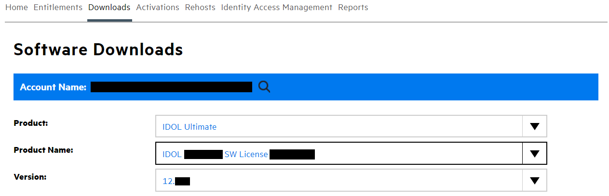

# IDOL ACI API introduction

In this lesson, you will:

- Learn about the key features of an ACI server,
- Configure and start an IDOL ACI service with your OEM license key, and
- Run a simple example programme in your preferred language(s) to communicate with an ACI service of your choice.

> NOTE: For this introduction, we will use IDOL Content Server as an example ACI service; however, you are free to follow along with your own server of choice.

---

- [Setup](#setup)
  - [Download IDOL components](#download-idol-components)
  - [Obtain an OEM license key](#obtain-an-oem-license-key)
  - [Install IDOL components](#install-idol-components)
- [IDOL ACI Servers](#idol-aci-servers)
- [Run ACI server](#run-aci-server)
  - [Interacting with ACI Service](#interacting-with-aci-service)
- [ACI API Documentation](#aci-api-documentation)
- [Example ACI Client programs](#example-aci-client-programs)
  - [C](#c)
  - [Python](#python)
  - [Java](#java)
  - [.NET](#net)
- [Conclusion](#conclusion)
- [See also](#see-also)

---

## Setup

Before you continue with this lesson, please refer to the documentation links [below](#see-also).

> NOTE: This lesson is a companion lesson to Connector, Content Server, Media Server and other ACI service lessons, where essential setup steps (*e.g.* required downloads and installation steps) and basic concepts are covered separately.

### Download IDOL components

Download software from the [Software Licensing and Downloads](https://sld.microfocus.com/mysoftware/index) portal.

1. Under the *Downloads* tab, select your product, product name and version from the dropdowns:

    

1. From the list of available files, select and download the following (depending on your platform and preferred language):
   - C: `IDOLCSDK_24.1.0_{PLATFORM}.zip`, *e.g.* `IDOLCSDK_24.1.0_WINDOWS_X86_64.zip`
   - Java: `idol-aci-client-24.1.0-bin.zip` or `idol-aci-client-24.1.0-bin.tar.gz`
   - .NET: `IDOLDotNetSDK_24.1.0_WINDOWS_X86_64.zip`,
   -  `Content_24.1.0_{PLATFORM}`, *e.g.* `Content_24.1.0_WINDOWS_X86_64.zip`, and
   -  `Versionkey_24.1.0_COMMON.zip`

### Obtain an OEM license key

Contact OpenText to obtain a trial OEM license key.  For this tutorial you will require the following two files:
1. `licensekeyInternal.dat`: the OEM license key file itself, and
2. `OEMstring.txt`: containing associated encryption keys required by clients making requests to Content Server.

### Install IDOL components

1. Copy your downloaded files into a new working folder.  The follow guide assumes this is `C:\OpenText` on Windows.

1. Extract the `.zip` files to give you:
   - `C:\OpenText\ACI_API\IDOLCSDK_24.1.0_WINDOWS_X86_64`, or
   - `C:\OpenText\ACI_API\IDOLJavaSDK_24.1.0\idol-aci-client-24.1.0-bin`, or
   - `C:\OpenText\ACI_API\IDOLDotNetSDK_24.1.0_WINDOWS_X86_64`, and
   - `C:\OpenText\Content_24.1.0_WINDOWS_X86_64`
  
1. Copy your OEM license key `.dat` file into `C:\OpenText\Content_24.1.0_WINDOWS_X86_64` (or the IDOL ACI server of your choice) and rename it to `licensekey.dat`.
   
    > HINT: this key will typically have been named `licensekeyInternal.dat` when you received it.

1. Extract the file `versionkey.dat` from `Versionkey_24.1.0_COMMON.zip`, then copy that file into `C:\OpenText\Content_24.1.0_WINDOWS_X86_64` as described in the [upgrade guide](https://www.microfocus.com/documentation/idol/IDOL_24_1/IDOLReleaseNotes_24.1_Documentation/idol/Content/Upgrade/Licenses.htm).

1. On Windows, you may need to install the included Visual C++ Redistributable package.  In the same IDOL Content Server folder, right-click on `vcredist_2017.exe` then select 'Run as administrator'.
   
    > HINT: If you see a version conflict error here, you may need to first uninstall any existing version.

## IDOL ACI Servers

All IDOL ACI servers include, *e.g.* under the directory: `C:\OpenText\Content_24.1.0_WINDOWS_X86_64`:
- an executable, in this case `content.exe`, and
- a primary configuration file with the same name, *e.g.* `content.cfg`.

An ACI server can be launched by running that executable or by configuring a service on [Windows](https://www.microfocus.com/documentation/idol/IDOL_24_1/IDOLServer_24.1_Documentation/Guides/html/gettingstarted/Content/Shared_Admin/Installation/_ADM_Install_WindowsServices.htm) or on [Linux](https://www.microfocus.com/documentation/idol/IDOL_24_1/IDOLServer_24.1_Documentation/Guides/html/gettingstarted/Content/Shared_Admin/Installation/_ADM_Install_LinuxStartup.htm).

Where you have an OEM license key, the ACI server looks on startup for a `licensekey.dat` file in the same directory as the executable.

> NOTE: With a non-OEM license, the primary configuration file must be modified to reference an instance of IDOL License Server, which is contacted to received permission to run.  Use of IDOL License Server is beyond the scope of this lesson.

## Run ACI server

Now, for the simplest start-up, double-click the `content.exe` (or the equivalent executable for your preferred ACI server).

Open the primary log file `logs/application.log` to see, among other messages, the following line:

```
This ACI Server will not accept unencrypted communications from ACI clients.
```

This line means that your IDOL Content Server has successfully picked up up the OEM license key and is ready to accept encrypted requests from an ACI Client.

### Interacting with ACI Service

IDOL ACI servers have at least two ports available to interact with: service port and ACI port.  

> NOTE: For IDOL Content Server, the ACI port is `9100` and the Service port is `9102` by default.  These values can be configured in `content.cfg`.  Any changes to this file require a restart to take effect.

The ACI port listens for ACI actions, which we have already read must be made via the ACI Client API, when the serer is OEM-licensed.  Service port actions however, can be made with plain HTTP requests, *i.e.* using your web browser of choice. We will try this now.

The service port actions are common to all ACI services.  Refer to [Service Actions](https://www.microfocus.com/documentation/idol/IDOL_24_1/Content_24.1_Documentation/Help/Content/Service/ServiceActions/_ACI_ServiceActions_Reference.htm) help for more details.

Let's first try out a service action on our running IDOL Content Server.  Click the following link to execute the action in your default browser:
http://localhost:9102/action=GetStatus
```xml
<ACTION>GETSTATUS</ACTION>
<RESPONSE>Running</RESPONSE>
<RESPONSEDATA></RESPONSEDATA>
```

> NOTE: Here we assume your IDOL Content Server is running on the same machine as your web browser. Adjust as needed. You will need to adjust `[AuthorizationRoles] [AdminRole] Clients=localhost` to something less restrictive if multiple hosts are involved.

To underline the point made above: if you try to run the same `GetStatus` (http://localhost:9100/action=GetStatus) action against the ACI port when using the OEM license, you will get the following error in response: `Unencrypted communications are disallowed`.

Refer to [OEM Encryption](https://www.microfocus.com/documentation/idol/IDOL_24_1/IDOLJavaSDK_24.1_Documentation/Guides/html/Content/OEMEncryption/app_OEM.htm) for more details on OEM licensing.

To make ACI action calls, we need to start working with the ACI API.

## ACI API Documentation

The [ACI API Programming Guide](https://www.microfocus.com/documentation/idol/IDOL_24_1/IDOLJavaSDK_24.1_Documentation/Guides/html/Content/Intro/intro_part.htm) is an excellent resource, which has been heavily relied upon for this lesson.

The API-specific reference documentation is located as below:
- [C Language Interface](https://www.microfocus.com/documentation/idol/IDOL_24_1/IDOLJavaSDK_24.1_Documentation/Guides/html/Content/C/c_part.htm)
- [Java Language Interface](https://www.microfocus.com/documentation/idol/IDOL_24_1/IDOLJavaSDK_24.1_Documentation/Guides/html/Content/Java/java_part.htm)
- [.NET Language Interface](https://www.microfocus.com/documentation/idol/IDOL_24_1/IDOLJavaSDK_24.1_Documentation/Guides/html/Content/NET/NET_part.htm)

## Example ACI Client programs

See examples below in each of the supported languages for the SDK.

### C

The C ACI API sample code [resources](../../resources/aci_api/C/README.md) build upon the information in the ACI API Programming Guide [C Language Interface](https://www.microfocus.com/documentation/idol/IDOL_24_1/IDOLJavaSDK_24.1_Documentation/Guides/html/Content/C/c_part.htm) providing working examples to interact with IDOL ACI services.

### Python

A Python wrapper for the C ACI API is included with these tutorials in the [resources](../../resources/aci_api/Python/README.md) folder.

### Java

The Java ACI API sample code [resources](../../resources/aci_api/Java/README.md) build upon the information in the ACI API Programming Guide [Java Language Interface](https://www.microfocus.com/documentation/idol/IDOL_24_1/IDOLJavaSDK_24.1_Documentation/Guides/html/Content/Java/java_part.htm) providing working examples to interact with IDOL ACI services.

### .NET

The .NET ACI API sample code [resources](../../resources/aci_api/dotnet/README.md) build upon the information in the ACI API Programming Guide [.NET Language Interface](https://www.microfocus.com/documentation/idol/IDOL_24_1/IDOLJavaSDK_24.1_Documentation/Guides/html/Content/NET/NET_part.htm) providing working examples, written in C#, to interact with IDOL ACI services.

## Conclusion

You now understand how to license and run any IDOL Server in an OEM deployment to receive requests from an ACI client.

You are familiar with how to communicate with an ACI server by service port and ACI port.

You have run your own client applications in C, Java, .NET and/or Python to interact with the ACI Server.

Next, why not try some more advanced use-cases with the ACI API from the [showcase page](./README.md#capability-showcase).

## See also

- [ACI API Programming Guide](https://www.microfocus.com/documentation/idol/IDOL_24_1/IDOLJavaSDK_24.1_Documentation/Guides/html/Content/Intro/intro_part.htm)
- [IDOL OEM Licensing Technical Note](https://www.microfocus.com/documentation/idol/IDOL_24_1/IDOLServer_24.1_Documentation/Guides/pdf/IDOL_24.1_OEMLicensing.pdf)
- [IDOL Getting Started Guide](https://www.microfocus.com/documentation/idol/IDOL_24_1/IDOLServer_24.1_Documentation/Guides/html/gettingstarted/index.html)
- [IDOL Expert](https://www.microfocus.com/documentation/idol/IDOL_24_1/IDOLServer_24.1_Documentation/Guides/html/expert/index.html)
- [IDOL Release Notes](https://www.microfocus.com/documentation/idol/IDOL_24_1/IDOLReleaseNotes_24.1_Documentation/idol/Content/_SDKs.htm)
