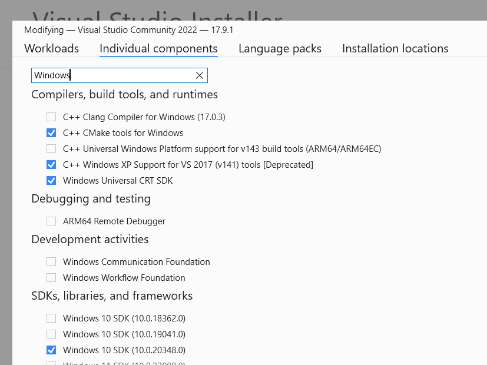

# Eduction SDK C API

The Eduction SDK is designed to be embedded into other services.

To facilitate embedding, the Eduction SDK has APIs for C, Java and .NET.  In addition, the Eduction SDK runs natively on the following platforms: Windows (x86_64), Linux (x86_64 and ARM_64), MacOS (x86_64 and Apple M*). 

In this lesson, you will:
- use the Eduction SDK C API to perform extraction using a configuration file
- use the Eduction SDK C API to compile a grammar XML into an ECR

The [Eduction User and Programming Guide](https://www.microfocus.com/documentation/idol/IDOL_24_2/EductionSDK_24.2_Documentation/Guides/html/Content/EductionSDK/APIReference/C_APIConcepts.htm) has sections on this topic which will be referenced in this lesson.

> NOTE: This lesson only covers the Eduction SDK APIs and does not cover Eduction Server. See [here](./README.md#use-idol-eduction-server) for a lesson on Eduction Server.

> NOTE: This guide assumes you have already completed the introductory Eduction [tutorial](../eduction/introduction.md#eduction-sdk-introduction).

---

- [Setup](#setup)
  - [License and Version key dat files](#license-and-version-key-dat-files)
  - [Resources](#resources)
  - [Environment and Compilers](#environment-and-compilers)
- [API Documentation](#api-documentation)
- [Example programs](#example-programs)
  - [`eduction_from_config`](#eduction_from_config)
    - [Sample code](#sample-code)
    - [Compile](#compile)
    - [Run](#run)
  - [`compile`](#compile-1)
    - [Sample code](#sample-code-1)
    - [Compile](#compile-2)
    - [Run](#run-1)
- [Conclusion](#conclusion)
- [See also](#see-also)

---

## Setup

Before you continue with this lesson, refer to the [documentation links](#see-also) below.

Refer to `README.md` in the `C:\OpenText\EductionSDK_24.2.0_WINDOWS_X86_64\samples` folder for API language and platform specific requirements and instructions to build the sample programs.

> NOTE: This lesson assumes you have already completed the [Eduction SDK introduction](../eduction/introduction.md#eduction-sdk-introduction) lesson covering essential setup steps (*e.g.* required downloads and installation steps) and basic Eduction concepts.

### License and Version key dat files

Deploy the `licensekey.dat` and `versionkey.dat` files to the EductionSDK home directory (e.g. `C:\OpenText\EductionSDK_24.2.0_WINDOWS_X86_64`).

> NOTE: An improved method to incorporate `versionkey.dat` is implemented as part of the provided resources, where you must ignore the release notes recommendation to pre-concatenate the `licensekey.dat` and `versionkey.dat`, delimited by a `;`. 

### Resources

You must download the following resources before you continue:
- source code and build tools
  - [eduction_from_config/c](../../resouces/eduction/sdk/samples/eduction_from_config/c)
  - [compile/c](../../resouces/eduction/sdk/samples/compile/c)

> NOTE: Deploy these resources to the `%EDK_HOME%\samples` folder, adding to and/or replacing what is provided with EductionSDK.

### Environment and Compilers

- Refer to the `System Requirements` section of the [IDOL Getting Started Guide](https://www.microfocus.com/documentation/idol/IDOL_24_2/IDOLServer_24.2_Documentation/Guides/html/gettingstarted/Content/Install_Run_IDOL/Install/System_Requirements.htm) for general software dependencies.
- Refer to [Eduction User & Programming Guide - Deploy Eduction SDK - C API Component](https://www.microfocus.com/documentation/idol/IDOL_24_2/EductionSDK_24.2_Documentation/Guides/html/Content/EductionSDK/DeployEductionSDK/C_API.htm) for API and platform specific software dependencies.
- The `README.md` in `C:\OpenText\EductionSDK_24.2.0_WINDOWS_X86_64\samples` notes more API language and platform specific requirements (*e.g.* compiler information, build tools) and build tips.

> HINT: For example, if you use Visual Studio Community 2022 in Windows 11, installed from https://visualstudio.microsoft.com/downloads/, run the Visual Studio Installer and ensure you have the "Windows 10 SDK" and "C++ CMake tools for Windows" components installed:
> 
> 

## API Documentation

API specific documentation is located in sub-folders of `C:\OpenText\EductionSDK_24.2.0_WINDOWS_X86_64\` as noted below:
- C - `c_api\help\index.html`

## Example programs

Example programs (with resources) ship with the `EductionSDK_<VERSION>_<PLATFORM>.zip` and `EductionGrammars_<VERSION>_COMMON.zip`.  The sample programs cover topics:
- performing different types of extraction / redaction.
- compiling an XML grammar into an ECR file

### `eduction_from_config`

The `eduction_from_config` sample program accepts a configuration file as you've been using in the other Eduction lessons, an UTF-8 text file, a path to the output JSON file and some optional arguments to override the configuration.

#### Sample code

The C sample `eduction_from_config` application code lives in: `C:\OpenText\EductionSDK_24.2.1_WINDOWS_X86_64\samples\eduction_from_config\c`.

Overwrite the file `CMakeLists.txt` in that folder with the updated example shipped with these tutorials in the resources folder [eduction_from_config/c](../../resouces/eduction/sdk/samples/eduction_from_config/c).

This file include an improved method for using the `versionkey.dat` file.

#### Compile

Open the folder `C:\OpenText\EductionSDK_24.2.1_WINDOWS_X86_64\samples\eduction_from_config\c` in Visual Studio 2022.

In the "Solution Explorer" view, right-click on the modified "CMakeLists.txt" and click "Build".

#### Run

Run your compiled program from the command prompt:

```cmd
> cd C:\OpenText\EductionSDK_24.2.1_WINDOWS_X86_64\samples\eduction_from_config\c
> out\build\x64-Debug\eduction_from_config.exe "..\resources\test\config\test.cfg" "..\resources\test\input\input.txt" "..\resources\test\test_output_c.json"
Program loaded.
Config Path:  ..\resources\test\config\test.cfg
Document Path: ..\resources\test\input\input.txt
Output File: ..\resources\test\test_output_c.json
Parameters valid.
Successfully configured 1 post-processing tasks.
Engine created.
Session created.
Input stream set for session.
Printing results to ..\resources\test\test_output_c.json...
Found 2 matches in total.
Extraction complete.
```
Review `test_output_c.json` to see the match information.  The program should run and produce an output file `C:\OpenText\EductionSDK_24.2.1_WINDOWS_X86_64\samples\eduction_from_config\resources\test\test_output_c.json` containing two matches, as follows:

```json
{
  "matches": [
    {
      "matched_text": "foo bar",
      "entity_name": "test/two_words",
      "offset": 12,
      "offset_length": 12,
      "matched_text_length": 7,
      "matched_text_size": 7,
      "normalized_text": "foo bar",
      "normalized_text_length": 7,
      "normalized_text_size": 7,
      "score": 1.00,
      "components": [
        {
          "name": "FIRST",
          "normalized_text": "foo",
          "normalized_text_length": 3,
          "normalized_text_size": 3,
          "normalized_text_offset": 0,
          "normalized_text_offset_length": 0
        },
        {
          "name": "SECOND",
          "normalized_text": "bar",
          "normalized_text_length": 3,
          "normalized_text_size": 3,
          "normalized_text_offset": 4,
          "normalized_text_offset_length": 4
        }
      ]
    },
    {
      "matched_text": "baz bah",
      "entity_name": "test/two_words",
      "offset": 20,
      "offset_length": 20,
      "matched_text_length": 7,
      "matched_text_size": 7,
      "normalized_text": "baz bah",
      "normalized_text_length": 7,
      "normalized_text_size": 7,
      "score": 1.00,
      "components": [
        {
          "name": "FIRST",
          "normalized_text": "baz",
          "normalized_text_length": 3,
          "normalized_text_size": 3,
          "normalized_text_offset": 0,
          "normalized_text_offset_length": 0
        },
        {
          "name": "SECOND",
          "normalized_text": "bah",
          "normalized_text_length": 3,
          "normalized_text_size": 3,
          "normalized_text_offset": 4,
          "normalized_text_offset_length": 4
        }
      ]
    }
  ]
}
```

For extra credit, try `eduction_from_config` on other Eduction configurations, insuring that configuration file paths are correct.

Review the `eduction_from_config` C source code to gain more insights into how to incorporate the Eduction SDK C API into your application.

### `compile`

In some use cases for Eduction, custom grammars either for net-new entities and/or extending the entities in the licensed grammar packs. 

> NOTE: While the Eduction SDK engine does support XML based resource files, pre-compiling them into ECRs is recommended.

The `compile` sample program accepts a grammar XML and output ECR.

#### Sample code

The C sample `compile` application code lives in: `C:\OpenText\EductionSDK_24.2.1_WINDOWS_X86_64\samples\compile\c`.

#### Compile

Open the folder `C:\OpenText\EductionSDK_24.2.1_WINDOWS_X86_64\samples\compile\c` in Visual Studio 2022.

In the "Solution Explorer" view, right-click on the modified "CMakeLists.txt" and click "Build".

#### Run

Run your compiled program from the command prompt:

```cmd
> cd C:\OpenText\EductionSDK_24.2.1_WINDOWS_X86_64\samples\compile\c
> out\build\x64-Debug\compile.exe "..\resources\test\source\test.xml" "..\resources\test\test_c.ecr"
Program loaded.
INFO: Grammar Path:  ..\resources\test\source\test.xml
INFO: Output Path:   ..\resources\test\test_c.ecr
Parameters valid.
Engine created.
Grammar source file loaded and compiled.
Compiled grammar file saved.
Program completed without an error.
```

The program should run and produce a compiled grammar file `C:\OpenText\EductionSDK_24.2.1_WINDOWS_X86_64\samples\compile\resources\test\test_c.ecr`.

For extra credit, try `compile` on other Eduction grammar XML.

Review the `compile` C source code to gain more insights into how to incorporate the Eduction SDK C API into your application.

## Conclusion

You now understand the basics of the Eduction SDK C API.

As extra credit, build and run the other sample programs in `EductionSDK_<VERSION>_<PLATFORM>\samples` and `EductionGrammars_<VERSION>_COMMON\pii\edk_samples`.  Refer to the changes in these resources and leverage the build tools & tips.

If you haven't already done so, try more tutorials that explore some of the other features available in IDOL Eduction, linked from the [main page](../README.md#capability-showcase-examples).

## See also

- [IDOL Eduction SDK User and Programming Guide](https://www.microfocus.com/documentation/idol/IDOL_24_2/EductionSDK_24.2_Documentation/Guides/html/)
- [IDOL Eduction Server User and Programming Guide](https://www.microfocus.com/documentation/idol/IDOL_24_2/EductionServer_24.2_Documentation/Help/Content/_ACI_Welcome.htm)
- [PCI Technical Note](https://www.microfocus.com/documentation/idol/IDOL_24_2/EductionGrammars_24.2_Documentation/PCI/)
- [PII Technical Note](https://www.microfocus.com/documentation/idol/IDOL_24_2/EductionGrammars_24.2_Documentation/PII/)
- [PHI Technical Note](https://www.microfocus.com/documentation/idol/IDOL_24_2/EductionGrammars_24.2_Documentation/PHI/)
- [Government Eduction Package Technical Note](https://www.microfocus.com/documentation/idol/IDOL_24_2/EductionGrammars_24.2_Documentation/GOV/)
- [IDOL and KeyView OEM Release Notes](https://www.microfocus.com/documentation/idol/IDOL_24_2/IDOLReleaseNotes_24.2_Documentation/idol/Content/SDKs/Eduction.htm)
