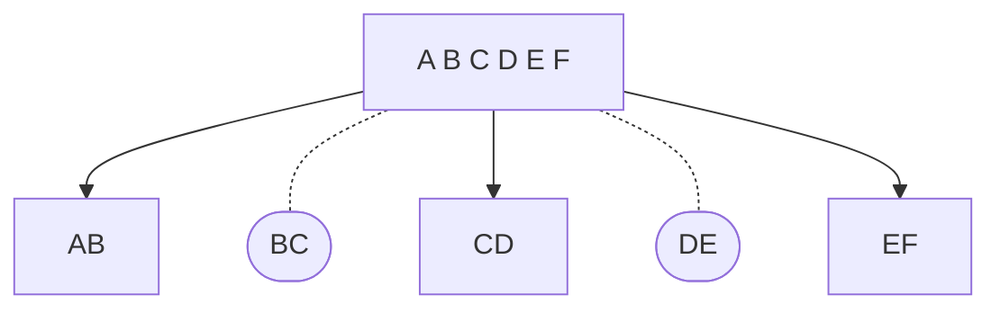

# Eduction SDK introduction

In this lesson, you will:

- Use the out-of-the-box binary `edktool` to develop your understanding of the key features and capabilities for matching entities in free text.
- Familiarize yourself with Eduction configuration files.
- Familiarize yourself with Eduction output.

---

- [Setup](#setup)
  - [Minimum requirements](#minimum-requirements)
  - [Useful third-party tools](#useful-third-party-tools)
  - [IDOL components](#idol-components)
    - [Download Eduction components](#download-eduction-components)
    - [Use version key](#use-version-key)
    - [Install Eduction SDK \& Grammars](#install-eduction-sdk--grammars)
    - [Environment variables](#environment-variables)
- [Introduction to Eduction](#introduction-to-eduction)
  - [Run `edktool`](#run-edktool)
  - [Explore contents of grammar ECR file](#explore-contents-of-grammar-ecr-file)
  - [Perform a first extraction](#perform-a-first-extraction)
    - [The configuration section](#the-configuration-section)
    - [The match section](#the-match-section)
    - [The grammar source](#the-grammar-source)
- [Review](#review)
  - [Rejected matches](#rejected-matches)
  - [Restricted match combinations](#restricted-match-combinations)
- [Conclusion](#conclusion)
- [See also](#see-also)

---

## Setup

Before you continue with this lesson, refer to the [documentation links](#see-also) below.

### Minimum requirements

- 1 core, 1 GB RAM, 5GB free disk space.
- Windows_x86_64, Linux_x86_64, Linux_ARM64, MacOS_x86_64 or MacOS_M1.
- An IDOL license key and software access.
- useful third-party tools noted below.

> Disk space includes zips, unzipped and generous working space.

> The following guide details steps for Windows. Steps will be similar for other supported platforms.

> Sizing for your own production tasks depends greatly on your use case, as discussed later in these tutorials.

### Useful third-party tools

- A (UTF-8 capable) text editor, *e.g.*:
  - [VS Code](https://code.visualstudio.com/download), or
  - [Notepad++](https://notepad-plus-plus.org/download)

- A Markdown viewer
  - Plugins to VS Code, Notepad++ and some web browsers are good options

### IDOL components

IDOL SDKs must embed an IDOL license key, which is unique to your project.

To obtain an IDOL license key, follow these [steps](../setup/license_key.md), then return here to continue.

#### Download Eduction components

Download software from the [Software Licensing and Downloads](https://sld.microfocus.com/mysoftware/index) portal.

1. Under the *Downloads* tab, select your product, product name and version from the dropdowns:

    

1. From the list of available files, select and download the following (depending on your platform):
   -  `EductionSDK_24.2.0_{PLATFORM}`, *e.g.* `EductionSDK_24.2.0_WINDOWS_X86_64.zip`,
   -  `EductionGrammars_24.2.0_COMMON.zip`, and
   -  `Versionkey_24.2.0_COMMON.zip`.

#### Use version key

Extract the file `versionkey.dat` from `Versionkey_24.2.0_COMMON.zip`, then follow the steps in the [IDOL Release Notes](https://www.microfocus.com/documentation/idol/IDOL_24_2/IDOLReleaseNotes_24.2_Documentation/idol/Content/Upgrade/Licenses.htm) to enable your license.

#### Install Eduction SDK & Grammars

1. Copy your downloaded files into a new working folder.  The follow guide assumes this is `C:\OpenText` on Windows.
2. Extract both of the `.zip` files to give you:
   - `C:\OpenText\EductionSDK_24.2.0_WINDOWS_X86_64`, and
   - `C:\OpenText\EductionGrammars_24.2.0_COMMON`
3. Copy your license key `.dat` file into `C:\OpenText\EductionSDK_23..0_WINDOWS_X86_64` and rename it to `licensekey.dat`
4. Extract the `versionkey.dat` from the `Versionkey_24.2.0_COMMON.zip` and deploy it alongside your license key `.dat` file.
5. On Windows, you may need to install the included Visual C++ Redistributable package.  In the same EductionSDK folder, right-click on `vcredist_2017.exe` then select 'Run as administrator'.  Perform the same with `vcredist_2019.exe` as needed.
    > HINT: If you see a version conflict error here, you may need to first uninstall any existing version.

See the [Eduction User & Programming Guide - Install Eduction](https://www.microfocus.com/documentation/idol/IDOL_24_2/EductionSDK_24.2_Documentation/Guides/html/Content/GettingStarted/Install/Install.htm) for more details.

#### Environment variables

For ease of use, update your environment variables to reference your new EductionSDK.

For Windows, open a command prompt window and enter:

```sh
set PATH=C:\OpenText\EductionSDK_24.2.0_WINDOWS_X86_64\bin;%PATH%
```
A batch file or shell script can be created to make this easier.

Or, from System Properties, add this path to your "PATH" System variable:


> NOTE: If updating to a newer version of EDK, open System Properties and ensure your "Path" variable refers to the latest version only.

## Introduction to Eduction

To get oriented with key concepts please read the "Getting Started" section of the [Eduction User & Programming Guide](https://www.microfocus.com/documentation/idol/IDOL_24_2/EductionSDK_24.2_Documentation/Guides/html/Content/part_intro.htm) before continuing.

The following lesson will show you to perform entity extraction.

### Run `edktool`

As our first step, let's run the included binary file `edktool`, then learn how to explore and a grammar ECR file to perform extraction.

Run the `edktool` command line program to yield usage instructions:

```sh
> cd C:\OpenText\EductionSDK_24.2.0_WINDOWS_X86_64\bin
> edktool
...
Eduction EDKTool Utility v24.2.0
(c) Copyright 2006-2023 Micro Focus International PLC

Usage: edktool  {
     generate    -i <inputfile> [-o <outputfile>] [-e <entityname>] |
     compile     [-i] <inputfile> [-e <entity>[,<entity>...]]
                 [-l <licensefile>] [-o <outputfile>] [-p] |
     list        <grammarfile> [-a] [-q]  |
     extract     [-l <licensefile>] -i <inputfile> [-c <configfile>]
                 [-g <grammarfile>[,<grammarfile>...]]
                 [-e <entity>[,<entity>...]] [-o <outputfile>] [-m] [-q]
                 [-r <redactionfile>] [-p] |
     measure     -e <expectedfile> -a <actualfile> [-o <resultsfile>] [-q]  |
     assess      [-l <licensefile>] [-o <resultsfile>] [-c <configfile>] [-a]
                 [-m <matched entities>] [-g <grammarfile>[,<grammarfile>...]]
                 [-e <entity>[,<entity>...]] [-v <valid input>]
                 [-w <invalid input>] [-x] [-q]  |
     permissions -d <directory> [-l <licensefile>] [-a] [-q]  |
     benchmark   [-l <licensefile>] -i <inputfile> [-c <configfile>]
                 [-g <grammarfile>[,<grammarfile>...]] |
                 [-e <entity>[,<entity>...]] [-s <sessions>] [-n <iterations>] [-d] [-b] [-C]
     unify       -g <grammarfile>[,<grammarfile>...] -o <outputfile>
                 -e <combinedentity>=<entity>,<entity>,... [-e ...]
                 [-l <licensefile>] |
     help        [<option>] }

Options:
  generate or g          Generates an uncompiled XML (source) file
     -i inputfile        The plaintext file containing one match per line
     -o outputfile       The destination for the output XML file
     -e entityname       The name for the single entity in the XML output

  compile or c           Compiles a grammar file
     -i inputfile        Input grammar file
     -e entities         Entities to be included in the grammar
     -l licensefile      The file containing the license key
     -o outputfile       Output grammar file
     -c compile_config   Path to a JSON compilation configuration file
     -p                  Treat the input file as plaintext rather than XML

  list or l              Lists the available entities in a grammar file
        grammarfile      The grammar file
     -a                  Show additional info - such as license requirements
     -q                  "Quiet Mode" suppresses all descriptive messages

  extract or e           Extract entities from a file
     -l licensefile      The file containing the license key
     -i inputfile        The file on which entity extraction will be performed
     -c configfile       A configuration file controlling the extraction
     -g grammarfiles     Grammar files to use, if "-c" is not used
     -e entities         The entities to extract, if "-c" is not used
     -o outputfile       The file containing the results of the extraction
     -m                  Produce match results for IDOL input files
     -f                  Returns the first match only
     -q                  "Quiet Mode" suppresses all descriptive messages
     -r redactionfile    A copy of the input file, with all matches redacted
     -p                  Treat the resource file as plaintext rather than XML
     -b                  Treat the contents of the input file as binary, rather than text

  measure or m           Measures precision and recall between extraction runs
     -e expectedfile     The expected results file from "edktool extract"
     -a actualfile       The actual results file from a separate extraction run
     -o resultsfile      The results: precision, recall and differences
     -q                  "Quiet Mode" suppresses all descriptive messages

  assess or a            Measures precision and recall, using user-defined data
     -l licensefile      The file containing the license key
     -a                  Show all results, including true matches
     -c configfile       A configuration file controlling the assessment
     -g grammarfiles     Grammar files to use, if "-c" is not used
     -e entities         The entities to extract, if "-c" is not used
     -x                  Sets comparison mode to "exact", if "-c" is not used
     -m "match entities" Entities to check results against, if "-c" is not used
     -v "valid input"    The file containing valid input, if "-c" is not used
     -w "invalid input"  The file containing invalid input, if "-c" is not used
     -o resultsfile      The results: false matches, precision and recall
     -q                  "Quiet Mode" suppresses all descriptive messages

  permissions or p       Displays all licensed grammar files in a directory
     -d directory        A directory containing some eduction grammar files
     -l licensefile      The file containing the license key
     -a                  Show additional information
     -q                  "Quiet Mode" suppresses all descriptive messages

  benchmark or b         Runs N extraction sessions concurrently M times to test grammar efficiency
     -l licensefile      The file containing the license key
     -i inputfile        The file on which entity extraction will be performed (plaintext only)
     -c configfile       A configuration file controlling the extraction
     -g grammarfiles     Grammar files to use, if "-c" is not used
     -e entities         The entities to extract, if "-c" is not used
     -s sessions         The number of extraction sessions to run concurrently
     -n iterations       The number of iterations to use
     -f                  Returns the first match only
     -d                  Outputs eduction match info. Incompatible with -C
     -b                  Treat the contents of the input file as binary, rather than text
     -C                  Only count the matches instead of gathering them. Incompatible with -d

  unify or u             Creates a grammar file with combined entities
     -g grammarfiles     Grammar files containing source entities
     -e entitydefinition Form "combined-name=source-name1,source-name2,..."
     -l licensefile      The file containing the license key
     -o outputfile       Output grammar file
    -c compile_config   Path to a JSON compilation configuration file
  
  validate or v          Validates a config file
     -c configfile       Configuration file to validate
     -l licensefile      The file containing the license key
     -o outputfile       (Optional) Output errors file (if any)
     -i                  Initialise an extraction session to verify entities can be loaded from config

  help or h              Displays edktool help
        option           More detailed help on the edktool option
```

See the [Eduction User & Programming Guide - edktool Command-Line Options](https://www.microfocus.com/documentation/idol/IDOL_24_2/EductionSDK_24.2_Documentation/Guides/html/Content/Reference/edktool/edktoolOptions_intro.htm) for more details.

### Explore contents of grammar ECR file

The Eduction SDK package contains useful sample resources, including simple grammar files for testing.

Let's use `edktool`'s `list` function to look at one of these samples.

From the command line, enter the following:

```sh
> cd C:\OpenText\EductionSDK_24.2.0_WINDOWS_X86_64\samples\eduction_from_config\resources\test\grammar
> edktool list test.ecr

Eduction EDKTool Utility v24.2.0
Loading resource file:
test.ecr


Grammar version:        4.0

Compiled using Edktool: 24.2.0

Listing entities:
test/two_words

0.024 seconds elapsed
```

We can see that the grammar file defined one public entity, mysteriously named `test/two words`.

> NOTE: `edktool` gives you elapsed time information, which we will find very useful for testing.

To get a bit more detail, re-run the same command with an extra `-a` flag:

```sh
edktool list -a test.ecr
```

The new part of the output is:

```
Listing entities:
test/two_words
    components: "FIRST" "SECOND"

Listing all necessary requirements for license:
    (none)
```

This gives more details of the construction of the entities, as well as specific licensing requirements for their use.  

`test.ecr` and the entity `test/two_words` is intentionally generic - matching any combination of two words.

To see an example of a real grammar file, explore the Eduction Grammars package, *e.g.*

```sh
> cd C:\OpenText\EductionGrammars_24.2.0_COMMON\pii
> edktool list address.ecr          

Eduction EDKTool Utility v24.2.0
Loading resource file:
address.ecr


Grammar version:        4.0

Compiled using Edktool: 24.2.0

Listing entities:
gdpr/address/at
gdpr/address/be
gdpr/address/bg
...
pii/address/tr
pii/address/us
pii/address/za

3.555 seconds elapsed
```

Many of these grammar files contain hundreds of entities, which are typically selectively applied for extraction. Some entities in a given ECR like `address.ecr` are specialized like `pii/address/city/context/CC` or similar where as `pii/address/CC` are general purpose in terms of their typical use.

> NOTE: The IDOL PII Package is backwards-compatible with the IDOL GDPR package. You can continue to use, *e.g.* the entity named `gdpr/address/at` in existing configurations, which is similar to the latest `pii/address/at` entity.

### Perform a first extraction

From the command line, enter the following:

```sh
> cd C:\OpenText\EductionSDK_24.2.0_WINDOWS_X86_64\samples\eduction_from_config\resources
> edktool extract -l ..\..\..\licensekey.dat -c test\config\test.cfg -i test\input\input.txt

Eduction EDKTool Utility v24.2.0
Extracting entities from:
  test\input\input.txt
using the config file:
  test\config\test.cfg
to the output:
  (Console)
using the license:
  ..\..\..\licensekey.dat

Successfully configured 1 post-processing tasks.
Beginning engine initialization (T+0.041 seconds)

Allow Duplicates: (None)
Allow Multiple Results: OnePerEntity
Allow Overlaps: false
Can't Have Fields: (None)
Case Normalization: None
Case Normalization Behaviour: DEFAULT
Case Sensitive Field Name: false
CJK Normalization: ArabicNumber
Databases: (All)
Document Delimiter CSV: (None)
Enable Components: true
Enable Unique Matches: false
Match Case: true
Match Timeout: 60000
Match Whole Word: true
Request Timeout: 300000
Max Entity Length: 256
Max Matches Per Doc: (Default)
Next Task: (None)
Non Greedy Match: false
Output Scores: true
Output Simple Match Info: false
Redacted Output: false
Search Fields: DRETITLE, SUMMARY, DRECONTENT
Suppress Match Logging: false
Tangible Characters: (None)
Token With Punctuation: false

Resource Files: ../resources/test/grammar/test.ecr
Entities:
  Entity0: test/two_words
Entity Minimum Scores:
  Entity0: 0
Entity Match Limits:
  Entity0: (unlimited)
Entity Fields:
  Entity0: TEST
Entity Match Ranges:
  Entity0: (All)
Zones:
Entity Zones:
Entity Component Fields:
Entity Advanced Fields:
Eduction initialized (T+0.135 seconds)
Opening data file...

<?xml version="1.0" encoding="UTF-8"?>
<MATCHLIST>
  <DOCUMENT Type="Plaintext" ID="Unknown">
    <MATCH EntityName="test/two_words" Offset="12" OffsetLength="12" Score="1" NormalizedTextSize="7" NormalizedTextLength="7" OriginalTextSize="7" OriginalTextLength="7">
      <ORIGINAL_TEXT>foo bar</ORIGINAL_TEXT>
      <NORMALIZED_TEXT>foo bar</NORMALIZED_TEXT>
      <COMPONENTS>
        <COMPONENT Name="FIRST" Text="foo" Offset="0" OffsetLength="0" TextSize="3" TextLength="3"/>
        <COMPONENT Name="SECOND" Text="bar" Offset="4" OffsetLength="4" TextSize="3" TextLength="3"/>
      </COMPONENTS>
    </MATCH>
    <MATCH EntityName="test/two_words" Offset="20" OffsetLength="20" Score="1" NormalizedTextSize="7" NormalizedTextLength="7" OriginalTextSize="7" OriginalTextLength="7">
      <ORIGINAL_TEXT>baz bah</ORIGINAL_TEXT>
      <NORMALIZED_TEXT>baz bah</NORMALIZED_TEXT>
      <COMPONENTS>
        <COMPONENT Name="FIRST" Text="baz" Offset="0" OffsetLength="0" TextSize="3" TextLength="3"/>
        <COMPONENT Name="SECOND" Text="bah" Offset="4" OffsetLength="4" TextSize="3" TextLength="3"/>
      </COMPONENTS>
    </MATCH>
  </DOCUMENT>
</MATCHLIST>
Entity search completed (T+0.292 seconds)

0.293 seconds elapsed
```

The output contains a lot of useful information for testing, including first, a record of the test files and configuration applied, followed by an XML representation of any detected entities, *i.e.* matches.

#### The configuration section

How were these configuration options applied?  Note the `-c test\config\test.cfg` flag used in the above command. This `.cfg` file contain our configuration options.  It is a best practice to control the behavior of the EDKEngine via a configuration file.

Open it on the command line by typing:

```sh
> cd C:\OpenText\EductionSDK_24.2.0_WINDOWS_X86_64\samples\eduction_from_config\resources
> type test\config\test.cfg 
```

The format of this configuration file may already be familiar to you if you have used other IDOL products.

First, in the `Eduction` section we reference our test `.ecr` grammar file(s) and then specify exactly which entities we want to use.  In this example, all of them, as specified by the `*` are enabled:

```ini
[Eduction]
ResourceFiles = ../resources/test/grammar/test.ecr
TangibleCharacters =
Entity0 = test/*
EntityField0 = TEST
```

We also provide an output name for any matches to these entities, here called "TEST".  IDOL components such as [CFS](https://www.microfocus.com/documentation/idol/IDOL_24_2/CFS_24.2_Documentation/Help/) make use of EntityField# value.

Further down, in the same `[Eduction]` section, we specify a section of runtime options for the EDKEngine:

```ini
EnableComponents = True
MatchWholeWord = True
AllowMultipleResults = OnePerEntity
EnableUniqueMatches = False
CaseSensitiveFieldName = False
AllowOverlaps = False
NonGreedyMatch = False
MatchCase = True
CaseNormalization = None
CaseNormalizationBehavior = Default
CJKNormalization = Number
MinScore = 0.5

Locale = ENG
LanguageDirectory = langfiles
```

For full details on these and other options, please reference [Eduction User & Programming Guide - Eduction Parameter Reference](https://www.microfocus.com/documentation/idol/IDOL_24_2/EductionSDK_24.2_Documentation/Guides/html/Content/Reference/EductionParameters.htm).

Lastly, an optional post-processing task is configured by referencing a `.lua` script:

```ini
PostProcessingTask0=pptask

[pptask]
Script = ../resources/test/scripts/postprocessing.lua
Entities = *
```

> NOTE: More than one post processing task can be configured.

For an introduction to the Lua language, look no further than [lua.org](https://www.lua.org/).  With IDOL Eduction, we use Lua to apply custom logic that can inspect and manipulate matches. Score and output normalization and algorithmic validation of matches (e.g. validating checksums) are some example use cases for this feature. The example script referenced above, for example, checks that matches contain fewer than eight characters:

```lua
function processmatch (edkmatch)
  if edkmatch then
    local text = edkmatch:getOutputText()
    if text:len() > 8 then
      return false
    end
    return true
  end
end
```

This example Lua post-processing function receives an object of class [`edkMatch`](https://www.microfocus.com/documentation/idol/IDOL_24_2/EductionSDK_24.2_Documentation/Guides/html/Content/Reference/LuaMethods/edkmatch.htm). This class provides useful getter and setter methods for access and manipulation of the Educed match (see below).

For more details on Lua post-processing, please reference [Eduction User & Programming Guide - Post-Processing](https://www.microfocus.com/documentation/idol/IDOL_24_2/EductionSDK_24.2_Documentation/Guides/html/Content/UseEduction/PostProcessing/LuaPostProcessing.htm).

#### The match section

Each Educed match provides the following key information:

- Which entity it was matched against.
- The match score, which is a measure of confidence.  The PII, PHI, PCI and Gov grammar packages make extensive use of scoring to indicate confidence.
- The location of the match, i.e. the character offset from the start of the text.
- A normalized version of the matched text, which can be very useful for dates, names, addresses, *etc.*
- Any components to the detection. If this were a name match, this could include a given name, family name and potentially a prefix such as "Mr." or "Mrs".

```xml
<?xml version="1.0" encoding="UTF-8"?>
<MATCHLIST>
  <DOCUMENT Type="Plaintext" ID="Unknown">
    <MATCH EntityName="test/two_words" Offset="12" OffsetLength="12" Score="1" NormalizedTextSize="7" NormalizedTextLength="7" OriginalTextSize="7" OriginalTextLength="7">
      <ORIGINAL_TEXT>foo bar</ORIGINAL_TEXT>
      <NORMALIZED_TEXT>foo bar</NORMALIZED_TEXT>
      <COMPONENTS>
        <COMPONENT Name="FIRST" Text="foo" Offset="0" OffsetLength="0" TextSize="3" TextLength="3"/>
        <COMPONENT Name="SECOND" Text="bar" Offset="4" OffsetLength="4" TextSize="3" TextLength="3"/>
      </COMPONENTS>
    </MATCH>
    <MATCH EntityName="test/two_words" Offset="20" OffsetLength="20" Score="1" NormalizedTextSize="7" NormalizedTextLength="7" OriginalTextSize="7" OriginalTextLength="7">
      <ORIGINAL_TEXT>baz bah</ORIGINAL_TEXT>
      <NORMALIZED_TEXT>baz bah</NORMALIZED_TEXT>
      <COMPONENTS>
        <COMPONENT Name="FIRST" Text="baz" Offset="0" OffsetLength="0" TextSize="3" TextLength="3"/>
        <COMPONENT Name="SECOND" Text="bah" Offset="4" OffsetLength="4" TextSize="3" TextLength="3"/>
      </COMPONENTS>
    </MATCH>
  </DOCUMENT>
</MATCHLIST>
```

Next, we will modify our command line options to send the match results to an `.xml` file:

```sh
> cd C:\OpenText\EductionSDK_24.2.0_WINDOWS_X86_64\samples\eduction_from_config\resources
> edktool extract -l ..\..\..\licensekey.dat -c test\config\test.cfg -i test\input\input.txt -o out.xml
```

> NOTE: The configuration details are output to screen as before but now the match information is not and is now found in the resulting `out.xml` file.

#### The grammar source

For the `test` example, the grammar source is provided - `EductionSDK_<VERSION>_<PLATFORM>\samples\eduction_from_config\resources\test\grammar\test.xml`. Let's explore some aspects of it.  The match intent of `test` is simple - find two words separate by a space. But the implementation does illustrate some valuable aspects of the Eduction engine grammar syntax:
1. private entity used by another entity
2. components
3. RegEx 

```xml
<?xml version="1.0" encoding="UTF-8"?>
<!DOCTYPE grammars SYSTEM "../published/edk.dtd">
<grammars version="4.0">
    <grammar name="test">
        <entity name="word" type="private">
            <pattern>\w+</pattern>
        </entity>

        <entity name="two_words" type="public">
            <pattern>(?A=FIRST:(?A:word)) (?A=SECOND:(?A:word))</pattern>
        </entity>
    </grammar>
</grammars>
```

By using the private entity `word`, the `two_words` entity can re-use the `word` entity - in this case 2 times vs. having to explicitly repeat the definition of `word`. In this example, `word` is a trivial pattern. But like in coding, a constant or function with a user friendly name makes a program easier to *understand* and *maintain*. The same is true with the implementation of entities.

The use of components `?A=FIRST:` and `?A=SECOND:` allows for the match data of `two_words` to *identify* and *label* the parts (aka components) of the match:

```xml
<MATCH EntityName="test/two_words" Offset="20" OffsetLength="20" Score="1" NormalizedTextSize="7" NormalizedTextLength="7" OriginalTextSize="7" OriginalTextLength="7">
  <ORIGINAL_TEXT>baz bah</ORIGINAL_TEXT>
  <NORMALIZED_TEXT>baz bah</NORMALIZED_TEXT>
  <COMPONENTS>
    <COMPONENT Name="FIRST" Text="baz" Offset="0" OffsetLength="0" TextSize="3" TextLength="3"/>
    <COMPONENT Name="SECOND" Text="bah" Offset="4" OffsetLength="4" TextSize="3" TextLength="3"/>
  </COMPONENTS>
```

Many of grammars in the `EductionGrammars_<VERSION>_COMMON` make use of components, to aid in post-processing (*e.g.* validation, scoring and output normalization), but also providing transparency into why a match occurred.

Reference the following for more details:

- [Create and Modify Eduction Grammars](https://www.microfocus.com/documentation/idol/IDOL_24_2/EductionSDK_24.2_Documentation/Guides/html/Content/UseEduction/Grammars/GrammarFormat.htm) 
- [Grammar Format Reference](https://www.microfocus.com/documentation/idol/IDOL_24_2/EductionSDK_24.2_Documentation/Guides/html/Content/Reference/GrammarReference/grammarReference.htm) 
- [Eduction Concepts - Components](https://www.microfocus.com/documentation/idol/IDOL_24_2/EductionSDK_24.2_Documentation/Guides/html/Content/GettingStarted/Introduction/Components2.htm)

And see the [Create a custom Eduction grammar](./README.md#create-a-custom-eduction-grammar) lesson for a more in-depth discussion on creating grammars.

## Review

Let's remind ourselves of what we have just done.  Ran `edktool`'s list function and ran `edktool`'s `extract` function with the following inputs:
- `test\config\test.cfg`
- `test\scripts\postprocessing.lua`
- `test\input\input.txt`

matching any combination of two words within the `input.txt`, then post-processing those matches to select only those word pairs with fewer than eight characters in total, using Lua.

From the input text: "Hello world foo bar baz bah", we found two matches:

1. "foo bar":
    ```xml
    <MATCH EntityName="test/two_words" Offset="12" OffsetLength="12" Score="1" NormalizedTextSize="7" NormalizedTextLength="7" OriginalTextSize="7" OriginalTextLength="7">
      <ORIGINAL_TEXT>foo bar</ORIGINAL_TEXT>
      <NORMALIZED_TEXT>foo bar</NORMALIZED_TEXT>
      <COMPONENTS>
        <COMPONENT Name="FIRST" Text="foo" Offset="0" OffsetLength="0" TextSize="3" TextLength="3"/>
        <COMPONENT Name="SECOND" Text="bar" Offset="4" OffsetLength="4" TextSize="3" TextLength="3"/>
      </COMPONENTS>
    </MATCH>
    ```
2. "baz bah":
    ```xml
    <MATCH EntityName="test/two_words" Offset="20" OffsetLength="20" Score="1" NormalizedTextSize="7" NormalizedTextLength="7" OriginalTextSize="7" OriginalTextLength="7">
      <ORIGINAL_TEXT>baz bah</ORIGINAL_TEXT>
      <NORMALIZED_TEXT>baz bah</NORMALIZED_TEXT>
      <COMPONENTS>
        <COMPONENT Name="FIRST" Text="baz" Offset="0" OffsetLength="0" TextSize="3" TextLength="3"/>
        <COMPONENT Name="SECOND" Text="bah" Offset="4" OffsetLength="4" TextSize="3" TextLength="3"/>
      </COMPONENTS>
    </MATCH>
    ```

So, why only these two combinations?

### Rejected matches

The first two words "Hello world" were rejected by post-processing because the total length of the pair is 11 characters, *i.e.* more than eight.

To match this word pair, modify your `test.cfg` as follows to disable post-processing:

```diff
[PostProcessingTasks]
- NumTasks = 1
+ NumTasks = 0
```

Now re-run the above command and notice a third match in your output:

```xml
<MATCH EntityName="test/two_words" Offset="0" OffsetLength="0" Score="1" NormalizedTextSize="11" NormalizedTextLength="11" OriginalTextSize="11" OriginalTextLength="11">
  <ORIGINAL_TEXT>Hello world</ORIGINAL_TEXT>
  <NORMALIZED_TEXT>Hello world</NORMALIZED_TEXT>
  <COMPONENTS>
    <COMPONENT Name="FIRST" Text="Hello" Offset="0" OffsetLength="0" TextSize="5" TextLength="5"/>
    <COMPONENT Name="SECOND" Text="world" Offset="6" OffsetLength="6" TextSize="5" TextLength="5"/>
  </COMPONENTS>
</MATCH>
```

### Restricted match combinations

At this point you may now be wondering why six input words resulting in only three output pairs and not five?

Why have the words "A B C D E F" only resulted in three combinations "AB",  "CD" and  "EF"?  What happened to "BC" and "DE"?



To understand this restriction, we need to review the configuration parameters applied, specifically:

```ini
AllowOverlaps = False
```

To change this behavior to include overlapping matches and return all five possible in-sequence combinations, modify your `test.cfg` as follows to disable pose-processing:

```diff
[Eduction]
- AllowOverlaps = False
+ AllowOverlaps = True
```

Now re-run the above command to see all five matches in your output.

For full details on this property, please reference [Eduction User & Programming Guide - AllowOverlaps](https://www.microfocus.com/documentation/idol/IDOL_24_2/EductionSDK_24.2_Documentation/Guides/html/Content/Configuration/Eduction/_EDU_AllowOverlaps.htm).

## Conclusion

You should now be confident in the basics of IDOL Eduction.  

Next, why not try more tutorials to explore some of the other features available in IDOL Eduction, linked from the [main page](../README.md#idol-eduction-showcase).

## See also

- [IDOL Eduction SDK User and Programming Guide](https://www.microfocus.com/documentation/idol/IDOL_24_2/EductionSDK_24.2_Documentation/Guides/html/)
- [IDOL Eduction Server User and Programming Guide](https://www.microfocus.com/documentation/idol/IDOL_24_2/EductionServer_24.2_Documentation/Help/Content/_ACI_Welcome.htm)
- [PCI Technical Note](https://www.microfocus.com/documentation/idol/IDOL_24_2/EductionGrammars_24.2_Documentation/PCI/)
- [PII Technical Note](https://www.microfocus.com/documentation/idol/IDOL_24_2/EductionGrammars_24.2_Documentation/PII/)
- [PHI Technical Note](https://www.microfocus.com/documentation/idol/IDOL_24_2/EductionGrammars_24.2_Documentation/PHI/)
- [Government Eduction Package Technical Note](https://www.microfocus.com/documentation/idol/IDOL_24_2/EductionGrammars_24.2_Documentation/GOV/)
- [IDOL and KeyView OEM Release Notes](https://www.microfocus.com/documentation/idol/IDOL_24_2/IDOLReleaseNotes_24.2_Documentation/idol/Content/SDKs/Eduction.htm)