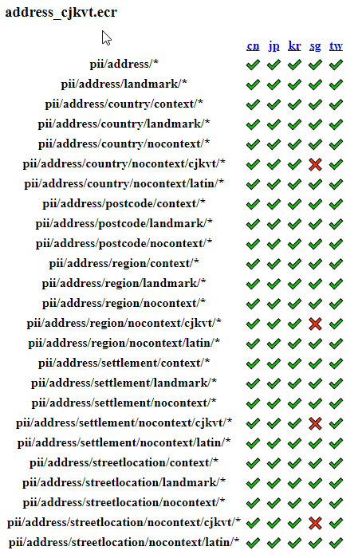

# Use PII Eduction grammars

The IDOL PII Package contains tools that allow you to find personal identifiable information (PII) in your data, to help you comply with regulations such as the General Data Protection Regulation (GDPR) and similar for other countries.

In this lesson, you will:

- Explore and use the out-of-the-box PII grammars.
- Gain an understanding of "context" vs "nocontext" entity forms.
- Introduce the concepts of targeted pre-filtering.

> NOTE: This guide assumes you have already completed the introductory Eduction [tutorial](./introduction.md#eduction-sdk-introduction).

---

- [Setup](#setup)
  - [Resources](#resources)
- [What's in the box?](#whats-in-the-box)
  - [Available grammar files](#available-grammar-files)
  - [Types of entities](#types-of-entities)
- [Address matching](#address-matching)
  - [Precision optimization](#precision-optimization)
  - [Speed optimizations](#speed-optimizations)
    - [Pre-filtering](#pre-filtering)
- [Conclusion](#conclusion)
- [See also](#see-also)

---

## Setup

Before you continue with this lesson, refer to the [documentation links](#see-also) below.

> NOTE: This lesson assumes you have already completed the [Eduction SDK introduction](../eduction/introduction.md#eduction-sdk-introduction) lesson covering essential setup steps (*e.g.* required downloads and installation steps) and basic Eduction concepts.

### Resources

Be sure to download the following resources before you continue:
- [PII address sample](../../resources/eduction/pii/edk_samples/resources/pii_address) and install to `C:\OpenText\EductionGrammars_23.3.0_COMMON\pii\edk_samples\resources\pii_address`
  
## What's in the box?

The IDOL PII Package includes IDOL Eduction Grammar files, pre-filters, postprocessing scripts (*e.g.* checksum & additional validation, output & score normalization and filtering) for certain entities.

### Available grammar files

To review which grammar files are included, list the directory `C:\OpenText\EductionGrammars_23.3.0_COMMON\pii`.  The command `edktool list -a <grammar>.ecr ` can be used to explore the public entities, available components and license requirements. Or open the `pii_entities.html` file in your web browser. This `.html` file conveniently lists available entities by locale as well as grammar file name.

As of 23.3.0 release, address detection is supported for 46 countries:




These tables are a different way of looking at the same information we saw in the [introductory tutorial](./introduction.md#explore-contents-of-grammar-ecr-file), when we used `edktool list` to inspect the `address.ecr` file.

Note that country support is split over two `.ecr` files:

1. `address_cjkvt.ecr` for China, Japan, Korea and Taiwan.
2. `address.ecr` for all the rest.

You will find a similar country split for many grammar files.  This is done for performance reasons since processing certain written languages (Chinese, Japanese, Korean, Vietnamese, and Thai) is complicated by the absence of spaces between words.

### Types of entities

In the above screenshots, note the multiple rows defining address entity support.

The naming structure can be explained with a few examples:

1. `pii/address/*` (where `*` can be replaced by an [ISO 3166-1 alpha-2 country code](https://www.microfocus.com/documentation/idol/IDOL_23_3/EductionGrammars_23.3_Documentation/PII/#CountryLanguage.htm)) - match full and/or partial postal addresses.
2. `pii/address/postcode/context/*` - match only a postal code (ZIP code) with context, *e.g.* to find a UK postcode in the text "Postcode: CB4 0WZ".
3. `pii/address/postcode/nocontext/*` - match a postal code without context, *e.g.* to find an Irish postcode in the text "W1B 5TG".
4. `pii/address/postcode/landmark/*` - match term or terms used to give context for a postal code, *e.g.* the word "Postcode" itself.

For full details of the entities included in the PII Grammar Package, please reference the [PII Package Technical Note](https://www.microfocus.com/documentation/idol/IDOL_23_3/EductionGrammars_23.3_Documentation/PII/#PII/PII_GrammarReference.htm).

> NOTE: The IDOL PII Package is backwards-compatible with the IDOL GDPR package. You can continue to use, *e.g.* the entity named `gdpr/address/at` in existing configurations, which is similar to the latest `pii/address/at` entity.

For address component entities, like postal codes, and other entities available with both "context" and "nocontext" options, consider that the "nocontext" version might over-match significantly (*i.e.*, we are likely to return values that are similar to the entity patterns, such a number that is not a postal code). However, not relying on context also reduces the number of false negatives (*i.e.*, we miss fewer matches). 

> NOTE: You can configure Eduction to use either versions of an entity, in which case matches located with context are given a higher score in the results.

## Address matching

Let's try this out now to see what information is returned from a match postal address.

Run the following commands to see the output:

```sh
cd C:\OpenText\EductionGrammars_23.3.0_COMMON\pii\edk_samples\resources
edktool extract -l ..\..\..\..\EductionSDK_23.3.0_WINDOWS_X86_64\licensekey.dat -c pii_address\config\address.cfg -i pii_address\input\input.txt
```

The resulting match is found in the line "John Smith lives at 742 Evergreen Terrace, Cambridge CB4 0WZ, United Kingdom.":

```xml
<?xml version="1.0" encoding="UTF-8"?>
<MATCHLIST>
  <DOCUMENT Type="Plaintext" ID="Unknown">
    <MATCH EntityName="pii/address/gb" Offset="20" OffsetLength="20" Score="1" NormalizedTextSize="40" NormalizedTextLength="40" OriginalTextSize="56" OriginalTextLength="56">
      <ORIGINAL_TEXT>742 Evergreen Terrace, Cambridge CB4 0WZ, United Kingdom</ORIGINAL_TEXT>
      <NORMALIZED_TEXT>742 EVERGREEN TERRACE, CAMBRIDGE, CB40WZ</NORMALIZED_TEXT>
      <COMPONENTS>
        <COMPONENT Name="NUMBER" Text="742" Offset="0" OffsetLength="0" TextSize="3" TextLength="3"/>
        <COMPONENT Name="STREET" Text="EVERGREEN TERRACE" Offset="4" OffsetLength="4" TextSize="17" TextLength="17"/>
        <COMPONENT Name="CITY" Text="CAMBRIDGE" Offset="23" OffsetLength="23" TextSize="9" TextLength="9"/>
        <COMPONENT Name="POSTCODE" Text="CB40WZ" Offset="33" OffsetLength="33" TextSize="6" TextLength="6"/>
        <COMPONENT Name="COUNTRY" Text="UNITED KINGDOM" Offset="42" OffsetLength="42" TextSize="14" TextLength="14"/>
      </COMPONENTS>
    </MATCH>
  </DOCUMENT>
</MATCHLIST>
```

> NOTE: This match is found with a score of `1` (on a scale of `0` to `1`) due to the presence of all expected parts of an address in the United Kingdom. The match also includes sub-fields detailing each component of the address and normalized output.

> NOTE: The overall processing time includes both the Eduction engine initialization time and input file processing time.  It's recommended and typical to persist the Eduction engine across documents so as incur engine initialization time once.

We could also choose to look only for a post code, as discussed above.  To do so, make the following edit to `pii\edk_samples\resources\test\config\address.cfg`, then re-run.

```diff
[Eduction]
- Entity0 = pii/address/gb
+ Entity0 = pii/address/postcode/context/gb
```

The resulting match is found in the line "His postcode is CB4 0WZ.":

```xml
<?xml version="1.0" encoding="UTF-8"?>
<MATCHLIST>
  <DOCUMENT Type="Plaintext" ID="Unknown">
    <MATCH EntityName="pii/address/postcode/context/gb" Offset="340" OffsetLength="340" Score="1" NormalizedTextSize="6" NormalizedTextLength="6" OriginalTextSize="19" OriginalTextLength="19">
      <ORIGINAL_TEXT>postcode is CB4 0WZ</ORIGINAL_TEXT>
      <NORMALIZED_TEXT>CB40WZ</NORMALIZED_TEXT>
      <COMPONENTS>
        <COMPONENT Name="POSTCODE" Text="CB40WZ" Offset="0" OffsetLength="0" TextSize="6" TextLength="6"/>
      </COMPONENTS>
    </MATCH>
  </DOCUMENT>
</MATCHLIST>
```

Finally, we can also look for the post code without context.  To do so, make the following edit to `pii\edk_samples\resources\test\config\address.cfg`, then re-run.

```diff
[Eduction]
- Entity0 = pii/address/postcode/context/gb
+ Entity0 = pii/address/postcode/nocontext/gb
```

The results now show two matches from both lines quoted above where a post code is given:

```xml
<?xml version="1.0" encoding="UTF-8"?>
<MATCHLIST>
  <DOCUMENT Type="Plaintext" ID="Unknown">
    <MATCH EntityName="pii/address/postcode/nocontext/gb" Offset="53" OffsetLength="53" Score="1" NormalizedTextSize="6" NormalizedTextLength="6" OriginalTextSize="7" OriginalTextLength="7">
      <ORIGINAL_TEXT>CB4 0WZ</ORIGINAL_TEXT>
      <NORMALIZED_TEXT>CB40WZ</NORMALIZED_TEXT>
      <COMPONENTS>
        <COMPONENT Name="POSTCODE" Text="CB40WZ" Offset="0" OffsetLength="0" TextSize="6" TextLength="6"/>
      </COMPONENTS>
    </MATCH>
    <MATCH EntityName="pii/address/postcode/nocontext/gb" Offset="352" OffsetLength="352" Score="1" NormalizedTextSize="6" NormalizedTextLength="6" OriginalTextSize="7" OriginalTextLength="7">
      <ORIGINAL_TEXT>CB4 0WZ</ORIGINAL_TEXT>
      <NORMALIZED_TEXT>CB40WZ</NORMALIZED_TEXT>
      <COMPONENTS>
        <COMPONENT Name="POSTCODE" Text="CB40WZ" Offset="0" OffsetLength="0" TextSize="6" TextLength="6"/>
      </COMPONENTS>
    </MATCH>
  </DOCUMENT>
</MATCHLIST>
```

### Precision optimization

To improve precision, the PII package also includes a set of validation scripts, which employ various approaches, including:

- stop-list filtering,
- ambiguous landmark detection,
- checksum validation, and
- score normalization.

You should already be familiar with how to run post-processing tasks with Lua scripts from the [introductory tutorial](./introduction.md#the-configuration-section).

Sticking to our current example of postal addresses, take a look at the included `address_stoplist.lua` script, which includes country-specific logic to update scores and address components.  For reference, `address_stoplist.lua` (and the many other helper PII scripts) are automatically invoked by `pii_postprocessing.lua`.

For more details on Lua post-processing, please reference [Eduction User & Programming Guide - Post-Processing](https://www.microfocus.com/documentation/idol/IDOL_23_3/EductionSDK_23.3_Documentation/Guides/html/#UseEduction/PostProcessing/LuaPostProcessing.htm).

### Speed optimizations

The PII package contains more to help you optimize performance.  Disabling output normalization is one consideration, as is pre-filtering.

#### Pre-filtering

The `pii\prefilter` folder includes configuration to quickly scan large volumes of text with simpler rules to allow you to target particular sections for full Eduction processing.

A first attempt to prefilter for addresses, for example, could be to use the `generic_numeric.cfg` file:

```ini
[Eduction]
PrefilterTask0=Prefilter0

// For use with any PII entity that is expected
// to contain a numeric portion (e.g. street address number, 
// telephone number, passport number *etc.*)
[Prefilter0]
Regex=\d
WindowCharsBeforeMatch=100
WindowCharsAfterMatch=100
```

This defines a config snippet that we could incorporate into any run-time Eduction configuration file.

This pre-filter could significantly reduce the amount of text to process by only keeping sections within 100 characters either side of a matched sequence of numbers.  Those numbers are quickly found with the regex expression `\d`.

For addresses, the PII package includes much more sophisticated pre-filtering scripts for you to use:
- `address_prefilter.cfg`,
- `address_cjkvt_prefilter.cfg`, and
- `address_fast_prefilter.cfg`.

For more details on pre-filtering, please reference [Eduction User and Programming Guide - Pre-Filter Tasks](https://www.microfocus.com/documentation/idol/IDOL_23_3/EductionSDK_23.3_Documentation/Guides/html/#UseEduction/PreFiltering/Introduction.htm).

## Conclusion

You now understand how to explore, use and optimize IDOL Eduction's PII grammar package.  Other grammars and entities within the PII package will look and behave similarly to `address.ecr`.

Next, why not try more tutorials to explore some of the other features available in IDOL Eduction, linked from the [main page](../README.md#idol-eduction-showcase).

## See also

- [IDOL PII Package Technical Note](https://www.microfocus.com/documentation/idol/IDOL_23_3/EductionGrammars_23.3_Documentation/PII/)
- [IDOL Eduction User and Programming Guide](https://www.microfocus.com/documentation/idol/IDOL_23_3/EductionSDK_23.3_Documentation/Guides/html)
- [IDOL and KeyView OEM Release Notes](https://www.microfocus.com/documentation/idol/IDOL_23_3/IDOLReleaseNotes_23.3_Documentation/oem/Content/SDKs/Eduction.htm)