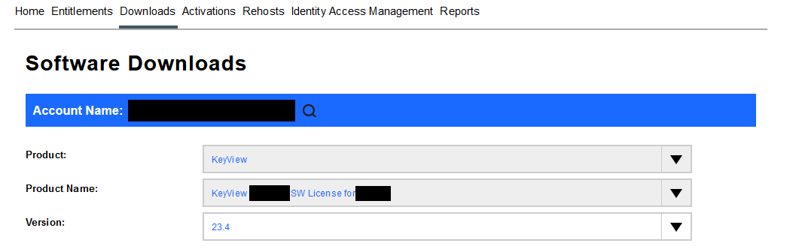

# Filter SDK Introduction

In this lesson, you will:

- Use the out-of-the-box command line tools `filter` and `tstxtract` to develop your understanding of the basic capabilities and key features of the Filter SDK.
- Familiarize yourself with Filter SDK output of the out-of-the-box command line tools.
- Familiarize yourself with Filter SDK configuration files.

---

- [Setup](#setup)
  - [Minimum requirements](#minimum-requirements)
  - [Resources](#resources)
  - [Useful third-party tools](#useful-third-party-tools)
  - [Filter SDK components](#filter-sdk-components)
    - [Activate a License Key](#activate-a-license-key)
    - [Download Filter SDK components](#download-filter-sdk-components)
    - [Install Filter SDK components](#install-filter-sdk-components)
- [Introduction to Filter SDK](#introduction-to-filter-sdk)
  - [Run `filtertest`](#run-filtertest)
  - [Format Detection](#format-detection)
  - [Metadata Extraction](#metadata-extraction)
    - [Perform metadata extraction](#perform-metadata-extraction)
  - [Text Extraction](#text-extraction)
    - [Visible text](#visible-text)
  - [Sub-file Extraction](#sub-file-extraction)
    - [Run `tstxtract`](#run-tstxtract)
    - [Perform sub-file extraction](#perform-sub-file-extraction)
- [Review](#review)
- [Conclusion](#conclusion)
- [See also](#see-also)

---

## Setup

Before you continue with this lesson, refer to the [documentation links](#see-also) below.

### Minimum requirements

- 1 core, 1 GB RAM, 5GB free disk space
- Windows x86_64, Windows x86_32, Linux_x86_64, Linux_ARM, MacOS_x86_64, MacOS_M1, ....
- Filter SDK license (optional, not required until using Filter SDK APIs)
- useful third party tools noted below.

> NOTE: Disk space includes room for zips, unzipped version and generous working space.

> NOTE: The following guide details steps for Windows.  Steps will be similar for other supported platforms.

> NOTE: Sizing for your own production tasks depends on your use case, as discussed later in these tutorials.

### Resources

Be sure to download the following resources before you continue:

- sample documents from [here](../../resources/keyview_filter/) and install to `C:\OpenText\idol-oem-tutorials\resources`

### Useful third-party tools

- A (UTF-8 capable) text editor, *e.g.*:

  - [VS Code](https://code.visualstudio.com/download), or
  - [Notepad++](https://notepad-plus-plus.org/downloads/), or
  - your favorite equivalent.

- A Markdown viewer
  - Plugins to VS Code, Notepad++ and some web browsers are good options

- PDF viewer
  - [Adobe Acrobat Reader](https://www.adobe.com/acrobat/pdf-reader.html), or
  - your favorite equivalent.

- 7z/RAR/Zip/Jar reader
  - [7-Zip](https://www.7-zip.org/), or
  - your favorite equivalent

- Microsoft Excel, PowerPoint, Word or other "Office" file capable reader
  
- Image Viewer, *e.g*:
  - [Microsoft Paint](https://apps.microsoft.com/detail/9pcfs5b6t72h?hl=en-US&gl=US), or
  - [ImageMagick](https://imagemagick.org/index.php), or
  - your favorite equivalent.

> NOTE: the PDF, "zip", "office" and image viewers are helpful tools to have, but not necessarily required.

### Filter SDK components

The OpenText File Content Extraction SDKs consist of the Filter SDK, Export SDK, Viewing SDK and Panopticon.  This lesson is focused on the Filter SDK, which offers the following capabilities:

- automatic format detection
- standard, custom and XMP metadata extraction
- text extraction (visible and hidden)
- character set detection and conversion
- sub-file extraction
- RMS decryption
- Optical Character Recognition (OCR)

#### Activate a License Key

The Filter SDK requires a license key, which is unique to your project.

To obtain a license key, follow these [steps](../setup/license_key_keyview.md), then return here to continue.



> NOTE: For the lessons that use , `filtertest`, `filter`, `extracttest` and `tstxtract`, a built-in (but expiring) license key is embedded in these executables. This means you can activate a license key later.

#### Download Filter SDK components

Download software from the [Software Licensing and Downloads](https://sld.microfocus.com/mysoftware/index) portal.

1. Under the *Downloads* tab, select your product, product name and version from the dropdowns:

2. From the list of available files, select and download the following (depending on your platform):
   - `KeyviewFilterSDK_25.4.0_{PLATFORM}`, *e.g.* `KeyviewFilterSDK_25.4.0_WINDOWS_X86_64.zip` or `KeyviewFilterSDK_25.4.0_LINUX_X86_64.exe` or similar for other supported platforms
   - `KeyviewFilterSDK_25.4.0_Documentation.zip`

    > NOTE: The installer `.exe` is only available for some available platforms: Linux_x86_32, Linux_x86_64, Windows_x86_32 and Windows_x86_64. This lesson will use the `.zip` package installation method.

3. From the list of available files, select and download any available patches for:

   - *e.g.* `KeyviewFilterSDK 25.4 Patch 25.4.x`

  > NOTE: Be sure to click on the `Reference Material` link under the `Description` column to access the link to the patch documentation which includes the release notes.

    - *e.g.* `KeyviewFilterSDK 25.1 Patch 25.1.x`

    > NOTE: Be sure to click on the `Reference Material` link under the `Description` column to access the link to the patch documentation which includes the release notes.

    > NOTE: All platforms are contained in the zip package for Keyview patches.

#### Install Filter SDK components

1. Copy your downloaded files into a new working folder.  The following guide assumes this is `C:\OpenText` on Windows.

2. Extract `KeyviewFilterSDK_<VERSION>_<PLATFORM>.zip` file to:

   - `C:\OpenText\KeyviewFilterSDK_25.4.0_WINDOWS_X86_64`

3. On Windows, you may need to install the included Visual C++ Redistributable packages. In the same FilterSDK's `vcredist` folder, right-click on `vcredist_2019.exe` then select 'Run as administrator'.

    > HINT: If you see a version conflict error here, you may need to first uninstall any existing version.

4. This lesson will refer to `C:\OpenText\KeyviewFilterSDK_25.4.0_WINDOWS_X86_64` as `%KEYVIEW_HOME%`.

5. If a patch is available for version being used, then extract *e.g.* `KeyviewFilterSDK_25.4.x.yyyy.zip` to:

   - `C:\OpenText\KeyviewFilterSDK_25.4.x.yyyy`

6. Backup existing files and copy new ones from appropriate `KeyviewFilterSDK_<VERSION>\<PLATFORM>` folder. It is most likely that patch files will be updates to those in `%KEYVIEW_HOME%\<PLATFORM>\bin` folder and sub-folders:

   - `C:\OpenText\KeyviewFilterSDK_25.4.0_WINDOWS_X86_64\WINDOWS_X86_64\bin`

7. Copy sample and test programs to bin folder:

    ```sh
    cd C:\OpenText\KeyviewFilterSDK_25.4.0_WINDOWS_X86_64\WINDOWS_X86_64\test
    copy *.exe ..\bin
    cd ..\bin
    ```

> NOTE: DO NOT mix & match patch updates across versions. *Only apply a patch update to its intended version*.

See the [Filter SDK Programming Guide - Introducing Filter SDK](
https://www.microfocus.com/documentation/idol/knowledge-discovery-25.4/KeyviewFilterSDK_25.4_Documentation/Guides/html/c-programming/Content/filter/intro_filtersdk.htm) for more details on installation.

## Introduction to Filter SDK

To get oriented with key concepts please read the [Introducing Filter SDK - Features](https://www.microfocus.com/documentation/idol/knowledge-discovery-25.4/KeyviewFilterSDK_25.4_Documentation/Guides/html/c-programming/Content/filter/Overview.htm) of the Filter SDK * Programming Guide before continuing.
  
The following lesson will explore file format detection and metadata / text / sub-file extraction using the test programs: `filtertest` and `extracttest`.  As extra credit one can also review the sample programs `filter` and `tstxtract` where source code and exe ships for these.
  
### Run `filtertest`

The test program `filtertest` is a command line tool that lets you exercise Filter API capabilities.  The binary is located in `%KEYVIEW_HOME%\<PLATFORM>\test`.

> NOTE: The exe's for the sample and test tools are not intended to be part of a typical distribution and thus packaged in the `%KEYVIEW_HOME%\<PLATFORM>\test` folder and need to be copied to the `%KEYVIEW_HOME%\<PLATFORM>\bin` folder to use as you should have already done.

```sh
> cd C:\OpenText\KeyviewFilterSDK_25.4.0_WINDOWS_X86_64\WINDOWS_X86_64\bin
> filtertest
WARNING: filtertest is a sample program only and is not for production use
Usage: [options] <input file> <output file>
[options] are:

Text Filtering Output Options
        [-ch] Filter text in chunks using fpFilter (default is to use fpFilterToFile)
                When filtering text in chunks with -ch you can specify '-' as the output filename to write filtered content to standard output
        [-embeddedfont] do not filter pdf embedded font
        [-fd] show DATETIME field code
        [-fn] show FILENAME field code
        [-hf] filter headers and footers
        [-keepsofthyphen] output soft-hyphen
        [-nc] do not filter comments from MS Word or PowerPoint documents
        [-no] do not filter embedded object in Office document
        [-nocr] do not perform OCR on raster images
        [-ocr languages orientation detectAlphabet textFindingMode] set OCR options (eg. -ocr en 1 2 3)
                languages: en (English), for a full list see KeyView documentation
                orientation: 0 (upright), 1 (any)
                detectAlphabet: 0 (off), 1 (listed), 2 (all)
                textFindingMode: 0 (document), 1 (scene), 2 (hollow), 3 (auto)
        [-pdfauto] specify logical order output for the input PDF file
        [-pdfltr] specify that the input PDF file is left-to-right dominate for logical order
        [-pdfrtl] specify that the input PDF file is right-to-left dominate for logical order
        [-pdfraw] use config api to force raw order mode for pdfsr reader
        [-sf opt] show formulas in spreadsheets
                opt: 0 (values only), 1 (formulas only), 2 (values and formulas)
        [-sh] show hidden text in MS Word documents
        [-tb] enable tab delimited output
        [-tc] track changes/revision marks (for Word only)
        [-td] enable PDF table detection (and tab delimited output)
        [-tn] export tagged content for pdfsr reader
        [-ed] enable Eduction friendly output options: tab delimited; output table delimiter; UTF8

Partial Filtering
        [-cl chunkLimit] set non-zero max number of chunks to process when filtering in chunks

Character Encodings
        [-c szCharSet] specify character set (eg. "KVCS_UNICODE").  Defaults to KVCS_UTF8
        [-cs szCharSet] specify source character set (eg. "KVCS_1252")
        [-n] prevent conversion of text character encoding

Autodetection
        [-a] get autodetect info, in following format (see Supported Formats Appendix):
                {file class} {format number} {version} {attributes}
        [-ah] get autodetect info, producing human-readable output including MIME type and format description
        [-A sourceCodeLevel] get autodetect info with source code detection turned to specified level: "off", "enabled", "extended"
        [-Ah sourceCodeLevel] get autodetect info with specified source code detection level, producing human-readable output

Metadata
        [-m] get metadata information
        [-ma] get all metadata information for pdfsr reader
        [-restrictions] get document restrictions

HTML
        [-html] Render the file to HTML

Protected Files
        [-ps srcPassword] specify the source document password
        [-rms credentialsfile] configure Filter for RMS decryption
                (credentialsfile is the path to a file which must contain just the tenant ID, client ID, and client secret, in that order, separated by new lines)

Global Configuration
        [-e] convert input file to stream before processing (filtering / autodetect / metadata)
        [-j] run detection and filtering in process
        [-o] run detection and filtering as a separate process (Out of Process)
        [-op] run detection and filtering as a separate process, using pipe streaming mode
        [-to timeout] specify the number of seconds/milliseconds (default is second but can be configued to be in millisecond) after which Filter should time out (only for use when running Out of Process)
        [-z tmpdir] specify a directory where temp files are created
        [-format summary/timing] Set console output format - operation summary, or timing data

By default, this sample program uses an embedded trial license. If the environment variable
KV_SAMPLE_PROGRAM_LICENSE_FROM_FILEPATH is set, this file will be read and its content will
be passed as a license to KeyView. This mechanism exists only to allow this program to be used
in testing after the expiry of its trial license, and should not be done in production code.
```

See the [Filter SDK Programming Guide](https://www.microfocus.com/documentation/idol/knowledge-discovery-25.4/KeyviewFilterSDK_25.4_Documentation/Guides/html/c-programming/Content/C/samples/filter.htm) to learn about `filter`, the sibling to `filtertest`.
  
### Format Detection

The Filter SDK automatically recognizes the file type being filtered. Your application does not need to rely on the file extension to determine the file types.  Other general file attributes like format version and encryption status are also provided as part of automatic format detection.

> NOTE: The exe's for the sample and test tools are not intended to be part of a typical distribution and thus packaged in the `%KEYVIEW_HOME%\<PLATFORM>\test` folder and need to be copied to the `%KEYVIEW_HOME%\<PLATFORM>\bin` folder to use as you should have already done.

From the command line, enter the following:

```sh
> cd C:\OpenText\KeyviewFilterSDK_25.4.0_WINDOWS_X86_64\WINDOWS_X86_64\bin
> filtertest -ah "..\..\..\idol-oem-tutorials\resources\keyview_filter\KeyViewFilterSDK_12.13.0_ReleaseNotes_en.pdf" detect
WARNING: filtertest is a sample program only and is not for production use
autodetect: ..\..\..\idol-oem-tutorials\resources\keyview_filter\KeyViewFilterSDK_12.13.0_ReleaseNotes_en.pdf to detect
Return code is 0
filtertest finished with RC: 0

> type detect
File Class:             1
Format Number:          230
Version:                1400
Attributes:             0
Description:            Adobe PDF (Portable Document Format)
MIME Type:              application/pdf
```

> NOTE: A return code of `0` is a positive result.

The Filter SDK correctly identified this file as a PDF.  `Class ID: 1` refers to the `adWORDPROCESSOR` category.  See the [Filter SDK Programming Guide - Supported Formats](https://www.microfocus.com/documentation/idol/knowledge-discovery-25.4/KeyviewFilterSDK_25.4_Documentation/Guides/html/c-programming/Content/kv_formats/_KV_FMT__AllDetected.htm) for more details about format class/category and format id/number.

For the PDF file format, the `Major Version: 1400` refers `PDF1.4`.  And there are zero attributes applied to `KeyViewFilterSDK_12.13.0_ReleaseNotes_en.pdf`.

> NOTE: The class and format ID assignment scheme was created for Filter SDK and does not relate to any standard. When applicable the [Appendixes - Supported Formats](https://www.microfocus.com/documentation/idol/knowledge-discovery-25.4/KeyviewFilterSDK_25.4_Documentation/Guides/html/c-programming/Content/kv_formats/_KV_FMT__Detected_Key.htm) documentation notes the MIME type, but not all file formats have MIME types.

Try `filtertest -ah` with your own test files. Good luck!

### Metadata Extraction
  
Documents can contain different flavors of metadata:

  1. There are the document properties like `title`, `author` and others.  Some formats support custom document properties where document author makes up the key for the assigned value.
  1. Some formats support [XMP Metadata](https://en.wikipedia.org/wiki/Extensible_Metadata_Platform).  PDF and image/audio/video file formats are the most common format categories that may contain XMP metadata.
  1. Some applications, and corresponding file formats, allow users to restrict the ways in which a document can be used. The Filter SDK supports identification of `write restrictions` for some file formats.  See [Document Restrictions](https://www.microfocus.com/documentation/idol/knowledge-discovery-25.4/KeyviewFilterSDK_25.4_Documentation/Guides/html/c-programming/Content/filter/DocumentRestrictions.htm) for more details.
  1. Repositories that store documents can also have metadata associated with documents.
  
  Of the above metadata flavors, the FilterSDK extracts 1, 2, and 3.  IDOL Connectors (or similar) get repository metadata.

#### Perform metadata extraction

> NOTE: The exe's for the sample and test tools are not intended to be part of a typical distribution and thus packaged in the `%KEYVIEW_HOME%\<PLATFORM>\test` folder and need to be copied to the `%KEYVIEW_HOME%\<PLATFORM>\bin` folder to use as you should have already done.

```sh
> cd C:\OpenText\KeyviewFilterSDK_25.4.0_WINDOWS_X86_64\WINDOWS_X86_64\bin
> filtertest -m "..\..\..\idol-oem-tutorials\resources\keyview_filter\KeyViewFilterSDK_12.13.0_ReleaseNotes_en.pdf" metadata
WARNING: filtertest is a sample program only and is not for production use
filter:..\..\..\idol-oem-tutorials\resources\KeyViewFilterSDK_12.13.0_ReleaseNotes_en.pdf to metadata
Return code is 0
filtertest finished with RC: 0
```

> NOTE: A return code of `0` is a positive result. Use your UTF-8 capable text editor, so you can properly view the output - just in case complex character sets are represented in the input document.

```
Name	Key	Type	Data	HasStandardAlternative	IsSuperseded	Source
"Title"	0	String	"IDOL KeyView Filter SDK 12.13.0 Release Notes"	true	false	0
"Title"	4000	String	"IDOL KeyView Filter SDK 12.13.0 Release Notes"	false	false	0
"Author"	0	String	"Micro Focus"	true	false	0
"Author"	2000	String	"Micro Focus"	false	false	0
"Create_DTM"	0	DateTime	"Fri Oct 21 14:21:17 2022"	true	false	0
"Created"	1000	DateTime	"Fri Oct 21 14:21:17 2022"	false	false	0
"LastSave_DTM"	0	DateTime	"Fri Oct 21 14:21:17 2022"	true	false	0
"Modified"	1001	DateTime	"Fri Oct 21 14:21:17 2022"	false	false	0
"PageCount"	0	Integer	10	true	false	0
"PageCount"	5000	Integer	10	false	false	0
"AppName"	0	String	"madbuild"	true	false	0
"Application"	2001	String	"madbuild"	false	false	0
```

The metadata output includes a couple of less than obvious values:

- The second column indicates where field name was standardized or not (0).
- The metadata output also includes the fields data type.

> NOTE: The apparent duplicate output is intentional referencing the original and standardized field name.  The Filter SDK API has options to output what is best for your use case.

Open `..\..\..\idol-oem-tutorials\resources\KeyViewFilterSDK_12.13.0_ReleaseNotes_en.pdf` in Adobe Acrobat Reader.  Go to `File --> Properties` and compare what you see in vs the output from `filtertest -m`.

Try `filtertest -m` with your own test files. Good luck!

### Text Extraction

Filter SDK supports the extraction of different types of text, which we'll divide up into visible and hidden text.

#### Visible text

> NOTE: The exe's for the sample and test tools are not intended to be part of a typical distribution and thus packaged in the `%KEYVIEW_HOME%\<PLATFORM>\test` folder and need to be copied to the `%KEYVIEW_HOME%\<PLATFORM>\bin` folder to use as you should have already done.

Visible text is what you easily see when you edit, view or print a document.

```sh
> filtertest -hf "..\..\..\idol-oem-tutorials\resources\keyview_filter\KeyViewFilterSDK_12.13.0_ReleaseNotes_en.pdf" text
WARNING: filtertest is a sample program only and is not for production use
filtertest: ..\..\..\idol-oem-tutorials\resources\keyview_filter\KeyViewFilterSDK_12.13.0_ReleaseNotes_en.pdf to text
filtertest: Target Charset is 53
filtertest finished with RC: 0
```

> NOTE: A return code of `0` is a positive result.  Use your UTF-8 capable text editor, so you can properly view the output - just in case complex character sets are represented in the test document.

Open `..\..\..\idol-oem-tutorials\resources\keyview_filter\KeyViewFilterSDK_12.13.0_ReleaseNotes_en.pdf` in Adobe Acrobat Reader. You'll notice that the `filter` output contains all of the visible text with the formatting resembling the original document.

Try `filtertest` with your own test files. Good luck!

> NOTE: Remember if you omit `-sh -tc -sf`, you will miss hidden txt.  So try again with these options if you think some text is missing.

### Sub-file Extraction

Many file formats can contain other files. ZIP and similar files are the most obvious of these. But emails often contain attachments, which in turn can contain other files. Inserting images or a spreadsheet into an "Office" style document like a presentation file is very common. PDFs can even contain other files.

Let's perform sub-file extraction on the Filter SDK Java API KeyView.jar.

#### Run `tstxtract`

> NOTE: The exe's for the sample and test tools are not intended to be part of a typical distribution and thus packaged in the `%KEYVIEW_HOME%\<PLATFORM>\test` folder and need to be copied to the `%KEYVIEW_HOME%\<PLATFORM>\bin` folder to use as you should have already done.

The test program `tstxtract` is a command line tool that demonstrates Extract API capabilities.  A pre-built binary is located in `%KEYVIEW_HOME%\<PLATFORM>\test`.

```sh
> cd C:\OpenText\KeyviewFilterSDK_25.4.0_WINDOWS_X86_64\WINDOWS_X86_64\bin
> tstxtract
WARNING: tstxtract is a sample program only and is not for production use
Usage: [options] <source file> <output directory> <keyview directory - optional>
Example: tstxtract inputfile outputdir
Example: tstxtract -l logfile -lm inputfile outputdir
When input file is a PST, please use absolute path
options are :
        [-c charset ] specify target character set (eg. "KVCS_SJIS")
        [-cf credfile1,credfile2,... ] specify input credential file(s) (eg. private key)
        [-l logfile ] give path and file name for logfile
        [-lm ] get subfile metadata and output to logfile
        [-i ] run as in-process
        [-r ] recursively extract subfiles that "needs extraction" to outputdir
        [-msg ] extract mail subfiles as native email (eg. extract MSG from PST)
        [-f ] extract mail subfiles in formatted (HTML or RTF or MHT) text
        [-e ] extract as stream with custom input and custom output stream
        [-p password1,password2,... ] specify password(s) to input file or the credential file(s)
        [-t ] preserve timestamp of embedded files when possible
        [-h ] extract hidden text
        [-to timeout ] set kvoop extraction timeout in seconds/milliseconds (default is second but can be configued to be in millisecond) (Filter SDK only)

By default, this sample program uses an embedded trial license. If the environment variable
KV_SAMPLE_PROGRAM_LICENSE_FROM_FILEPATH is set, this file will be read and its content will
be passed as a license to KeyView. This mechanism exists only to allow this program to be used
in testing after the expiry of its trial license, and should not be done in production code.
```
  
#### Perform sub-file extraction

Before we run `tstxtract`, we'll create an output folder `_extract`. Any location and name for the extraction destination directory will suffice where `_extract` and its location was chosen for convenience.

```sh
> cd C:\OpenText\KeyviewFilterSDK_25.4.0_WINDOWS_X86_64\WINDOWS_X86_64\bin
> mkdir _extract
> tstxtract ..\..\javaapi\KeyView.jar _extract
File ..\..\javaapi\KeyView.jar has 122 sub-files, charset: 0, format: 999
tstxtract return code: 0
```

> NOTE: return code: 0 is a positive result equivalent to `KVERR_Success`.

```sh
> dir _extract
Volume in drive D is DDrive
 Volume Serial Number is 66F6-7BE6

 Directory of C:\OpenText\KeyviewFilterSDK_25.4.0\WINDOWS_X86_64\bin\_extract

07/01/2022  09:16 AM    <DIR>          .
07/01/2022  09:16 AM    <DIR>          ..
07/01/2022  09:16 AM    <DIR>          com
07/01/2022  09:16 AM             4,959 htmlinfo.properties
07/01/2022  09:16 AM    <DIR>          META-INF
07/01/2022  09:16 AM             3,999 xmlinfo.properties
               2 File(s)          8,958 bytes
               4 Dir(s)  1,461,157,371,904 bytes free
```

122 sub-files are extracted with the directory structure preserved.
  
> NOTE: In some cases Filter SDK will auto-generate a filename for extract files.
  
> NOTE: Image extraction is not enabled by default. See the [Filter SDK Programming Guide - Extract Images](https://www.microfocus.com/documentation/idol/knowledge-discovery-25.4/KeyviewFilterSDK_25.4_Documentation/Guides/html/c-programming/Content/Shared/_KV_xtract_Extract_Images.htm) for details on how to enable. You'll learn a little bit about the `filter\formats.ini` file.
  
> NOTE: Remember to delete the extracted contents of the `_extract` folder between each iteration.  

Try `tstxtract` with your own test files. Good luck!
  
## Review

In this lesson, you used Filter SDK to automatically detect the file format, perform basic metadata and text extraction, extract sub-files and configuring the `formats.ini`. There are other nuances with Filter SDK that you'll encounter over time. Remember file formats are at times inherently more complex than you can imagine.
  
## Conclusion

You should now be confident in the basics of the Filter SDK.

Next, why not try more tutorials to explore some of the other features available in Filter SDK, linked from [here](../keyview_filter/README.md#capability-showcase).

## See also

- [Filter SDK C Programming Guide](https://www.microfocus.com/documentation/idol/knowledge-discovery-25.4/KeyviewFilterSDK_25.4_Documentation/Guides/html/c-programming/index.html)
- [Filter SDK C++ Programming Guide](https://www.microfocus.com/documentation/idol/knowledge-discovery-25.4/KeyviewFilterSDK_25.4_Documentation/Guides/html/cpp-programming/index.html)
- [Filter SDK Java Programming Guide](https://www.microfocus.com/documentation/idol/knowledge-discovery-25.4/KeyviewFilterSDK_25.4_Documentation/Guides/html/java-programming/index.html)
- [Filter SDK .NET Programming Guide](https://www.microfocus.com/documentation/idol/knowledge-discovery-25.4/KeyviewFilterSDK_25.4_Documentation/Guides/html/dotnet-programming/index.html)
- [Filter SDK Python Programming Guide](https://www.microfocus.com/documentation/idol/knowledge-discovery-25.4/KeyviewFilterSDK_25.4_Documentation/Guides/html/python-programming/)
- [File Content Extraction Release Notes](https://www.microfocus.com/documentation/idol/knowledge-discovery-25.4/IDOLReleaseNotes_25.4_Documentation/oem/Content/_KeyView.htm)
