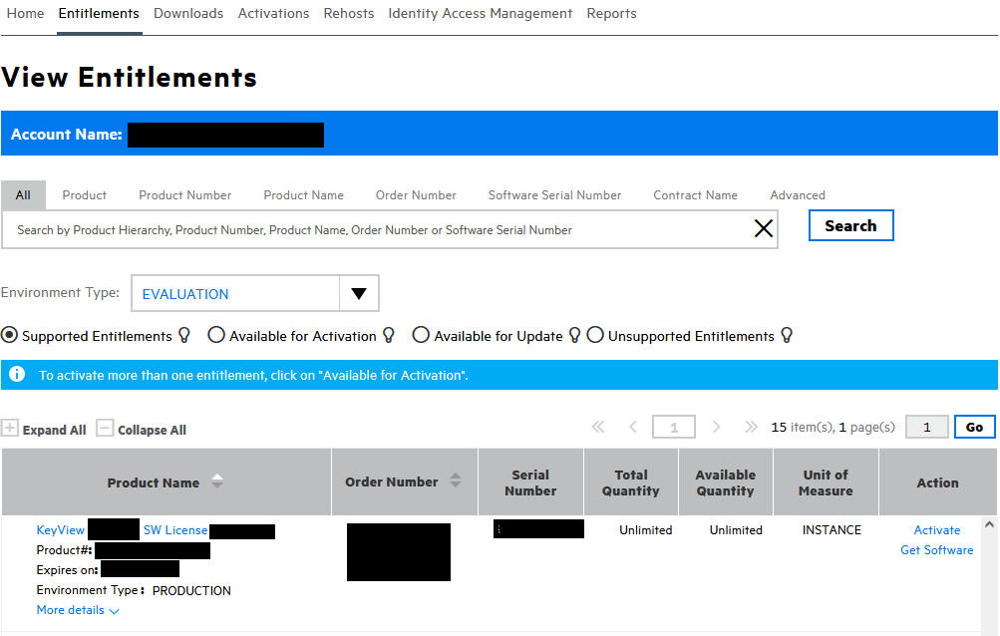
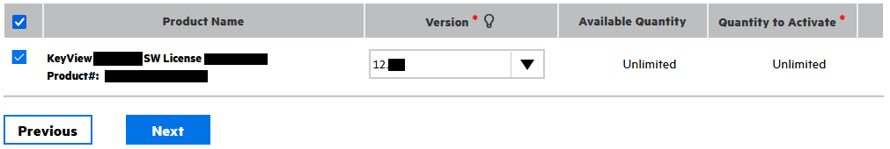
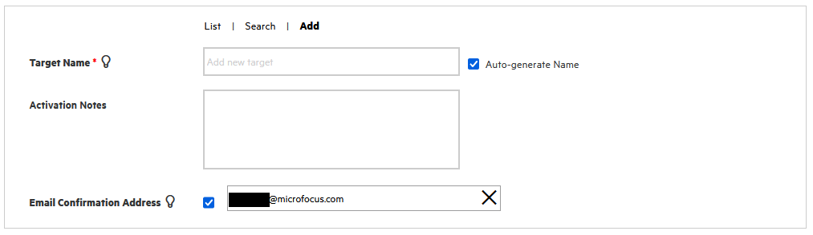

# Obtain an KeyView license

You can obtain software and licenses from the [Software Licensing and Downloads](https://sld.microfocus.com/mysoftware/index) portal.

1. Under the *Entitlements* tab, search for *keyview*
1. Select from your available environment types:
1. Scroll to the bottom and click `Activate` next to your *KeyView SW license*

    
 
1. On the "License Activation" screen, at the bottom, select the check box, choose your preferred version (the latest is 23.4), then fill in the quantity to activate:

   

1. Above this section, fill in the requested details:

   

    > NOTE: In these tutorials you will primarily use SDKs, where you will embed and/or reference this license key.

1. Click "Next", then confirm your details and click "Submit".  You will soon received your key, which is a `.txt` file, by email.
